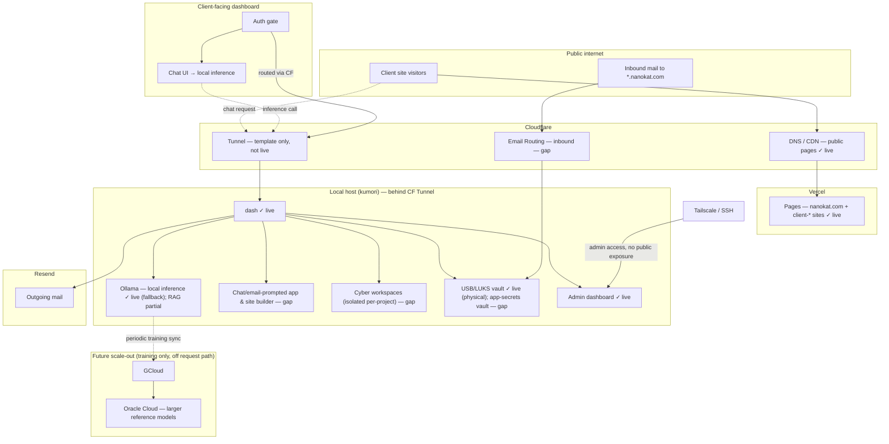
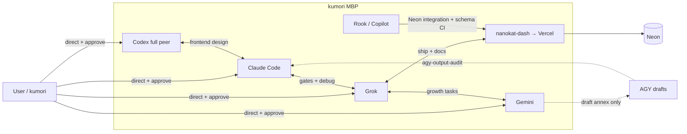

# NANOKAT Forge — All-Qwen Mission Society Master Handoff

**Prepared for:** the Qwen workspace assistant currently being introduced into `~/hack/nk-forge`  
**Prepared by:** Aster for Kumori  
**Date:** 2026-07-20  
**Status:** implementation handoff; inspect before modifying  
**Authority:** this front section is the current hackathon direction. The appended documents are supporting context and may describe older multi-provider routing or the larger NANOKAT monorepo.

---

## 0. Receiving-Qwen instructions

You are being asked to help finish the NANOKAT Forge hackathon build. Before proposing code or claiming any change:

1. State whether you actually have repository read/write and shell/tool access.
2. Inspect the repository if those tools exist.
3. Do not claim to have run commands, edited files, called APIs, or deployed unless you truly did.
4. Do not print, read aloud, copy, summarize, or expose secret values.
5. Do not change DNS, certificates, cloud configuration, credentials, Git remotes, or production settings.
6. Leave changes uncommitted unless Kumori explicitly says `commit`.
7. Treat the repository and executed tests as truth; treat this document as a plan and continuity handoff.
8. The old assumption that several external model providers are available is obsolete for this hackathon runtime. Qwen must fill every runtime role.

### Your naming step

Choose a concise personal name for yourself before implementation. Return:

```json
{
  "displayName": "your chosen name",
  "motto": "one sentence",
  "workingStyle": "one sentence",
  "temperament": ["trait", "trait", "trait"],
  "biasDisclosure": "one honest sentence about the approach you tend to favor"
}
```

Your chosen name does **not** grant new permissions. Your current assignment is repository architect and implementer for this scoped hackathon build, subject to Kumori's approval and the safety boundaries below.

---

## 1. Objective

Turn the working NANOKAT Forge Qwen prototype into a polished, demonstrable **all-Qwen mission-solving society**:

```text
User describes a real situation
→ Qwen identifies the actual mission
→ Qwen assembles a prompt-specific specialist society
→ selected Qwen agents analyze in parallel
→ their disagreements are exposed and challenged
→ scenarios and stakeholder reactions are modeled
→ a Council Chair produces a resolved strategy while preserving dissent
→ the user approves specific actions
→ only approved, allowlisted tools execute
→ deterministic validation tests the outputs
→ one constrained Qwen repair attempt may fix failures
→ the user receives a mission package with evidence, strategy, artifacts, trace, and recovery information
```

The product is **not** a website prompt engine. A website, résumé, portfolio, flyer, campaign kit, workflow, research memo, data analysis, business card, or dashboard is only one possible artifact produced for a larger mission.

---

## 2. Verified and reported current state

The following is current conversation-level state and must be verified against Git and files before modification.

### Reported working baseline

- Hackathon repository: `~/hack/nk-forge`
- Orchestrator: `~/hack/nk-forge/apps/orchestrator`
- Node runtime: Node.js 22
- Main server: `apps/orchestrator/server.mjs`
- Static frontend:
  - `apps/orchestrator/public/index.html`
  - `apps/orchestrator/public/styles.css`
  - `apps/orchestrator/public/app.js`
- Package uses the OpenAI Node SDK as an OpenAI-compatible client for Alibaba Model Studio.
- Function Compute startup command: `node server.mjs`
- Port: `9000`
- Function Compute region: Singapore
- Runtime target model: `qwen3.7-plus`
- Existing deployment and custom domain have worked.
- Existing routes have included:
  - `GET /health`
  - `POST /api/plan`
  - `POST /api/build-preview`
- Existing demo-token protection uses `x-nanokat-demo-token`.
- Existing UI proves brief → plan → explicit approval → scoped preview.
- Credentials exposed earlier were rotated.
- Kumori reports Git and TruffleHog checks were run.
- DNS and certificate work are complete enough for the demo and must be frozen.
- There are no other active runtime agents or model providers for this build. Qwen fills every role.

### New local files reportedly created

- `apps/orchestrator/src/agents/models.mjs`
- `apps/orchestrator/src/agents/smoke-agent.mjs`

The model registry reportedly maps all roles to `qwen3.7-plus` by default.

### Immediate blocker

The newest local Navigator smoke test returned:

```text
401 invalid_api_key
```

That means the local `DASHSCOPE_API_KEY` and configured DashScope/Model Studio base URL are invalid, disabled, from a mismatched region/workspace/plan, or otherwise incompatible. Do not work around this with an OpenAI or Anthropic key. The Qwen runtime requires an Alibaba Model Studio/DashScope key that matches the configured endpoint.

### Important model distinction

The interactive Qwen CLI screenshot showed `qwen-plus`. The application runtime target is `qwen3.7-plus`. Do not silently change the application model based on the CLI display. Verify model access through the actual Model Studio account and endpoint.

### Unverified until inspected

- Current Git branch
- Dirty/staged files
- Latest commit
- Remote configuration
- Exact current contents of `server.mjs`
- Whether the deployed Function Compute ZIP matches local files
- Whether `npm test` exists and passes
- Whether the current API key issue affects only local configuration or the deployed function too

---

## 3. First action: inspect, stabilize, then implement

Run from the repository root:

```bash
cd ~/hack/nk-forge
pwd
git rev-parse --show-toplevel
git branch --show-current
git status --short --branch
git remote -v
git log -5 --oneline
find .. -name AGENTS.md -o -name CLAUDE.md -o -name QWEN.md 2>/dev/null
sed -n '1,240p' package.json 2>/dev/null || true
sed -n '1,260p' apps/orchestrator/package.json
sed -n '1,320p' apps/orchestrator/server.mjs
find apps/orchestrator -maxdepth 3 -type f | sort
```

Do not display `.env` files or secret values.

Then verify syntax:

```bash
node --check apps/orchestrator/server.mjs
node --check apps/orchestrator/public/app.js
find apps/orchestrator/src -name '*.mjs' -print0 2>/dev/null |
  xargs -0 -r -n1 node --check
```

Fix the key/endpoint pairing before building more orchestration. The Navigator smoke test must pass with structured JSON.

---

## 4. Product definition

### The promise

NANOKAT Forge accepts an ambiguous request and forms a small expert mission team tailored to the person's real situation. It researches what can be researched, distinguishes evidence from assumptions, examines positive and negative paths, accounts for the operator's emotional and practical reality, proposes a strategy, asks for granular approval, and produces only approved outputs.

### Example domains

- Farmer planning a season
- Florist reducing perishable inventory waste
- Musician promoting an acoustic show
- Artisan digitizing a business
- Job seeker diagnosing weak results
- Small business automating intake or follow-up
- Nonprofit planning a local campaign
- Creator launching a product or release
- Failed campaign performing a retrospective and mitigation plan

### Website rule

A website is selected only when it materially advances the mission. It must never be the default answer merely because the system can generate one.

---

## 5. Architectural principles

1. **One Qwen engine, many bounded roles.** Role prompts, evidence, permissions, and outputs create specialization.
2. **Personality is not authority.** Names and style can vary; permissions cannot.
3. **Dynamic assembly.** Invoke only the perspectives justified by the mission.
4. **Disagreement is a feature.** The system must not flatten every answer into fake consensus.
5. **Evidence is labeled.** Separate retrieved facts, user-supplied information, inference, forecasts, and missing evidence.
6. **Approval precedes effects.** The model may propose actions; the user approves individual action IDs.
7. **Allowlisted tools only.** No arbitrary shell, network, repository, deployment, messaging, purchasing, or DNS operations.
8. **Deterministic checks precede model judgment.** Schemas and safety conditions are code-enforced.
9. **One repair attempt.** No uncontrolled loops.
10. **Stateless deployment compatibility.** Mission state must survive request boundaries through a signed envelope, not process memory.
11. **Recoverability.** Every run returns a trace, validation record, non-actions, and recovery manifest.
12. **Honest capability.** Never claim research, prediction, execution, or persistence that was not implemented.

---

## 6. Qwen society role registry

All roles initially use `qwen3.7-plus`.

### Required registry fields

```json
{
  "roleId": "skeptical-analyst",
  "displayName": "persistent self-chosen name",
  "purpose": "Challenge unsupported assumptions and weak plans.",
  "temperament": ["direct", "evidence-focused", "cautious"],
  "biasDisclosure": "I favor survivability over aggressive growth.",
  "permissions": ["analyze", "challenge", "recommend"],
  "forbidden": ["execute", "publish", "contact", "spend"]
}
```

### Core roles

#### Navigator

Determines the stated request, actual outcome, constraints, unknowns, sensitivities, possible deliverables, and which specialists should participate. It must explicitly decide whether a website is necessary.

#### Researcher

Identifies what information is needed, evaluates supplied evidence, invokes approved research capabilities when present, preserves sources, and separates verified findings from inference.

#### Domain Analyst

Adapts to the mission domain and its practical constraints. It must disclose when the domain requires expertise or data the system does not possess.

#### Human-Factors Analyst

Examines energy, emotional state, fear, confidence, accessibility, money, time, skills, habits, operator burden, and social context. It does not diagnose mental illness.

#### Opportunity Strategist

Looks for leverage, partnerships, creative positioning, reusable assets, asymmetric opportunities, and low-cost experiments.

#### Skeptical Analyst

Runs a pre-mortem, challenges assumptions, identifies failure modes, detects vague goals, and protects against wishful thinking.

#### Forecaster

Creates baseline, upside, and downside scenarios with explicit assumptions, early signals, pivot thresholds, and limitations. It avoids fake numerical precision.

#### Stakeholder Simulator

Models how customers, collaborators, visitors, competitors, operators, and affected communities may respond. It labels simulation as inference, not observed fact.

#### Ethics and Compliance Analyst

Activates for politics, health, finance, law, personal data, persuasion, vulnerable people, or other sensitive domains. It narrows or blocks unsafe actions.

#### Systems Analyst

Maps workflows, repetitive tasks, data dependencies, automation candidates, human checkpoints, failure recovery, and implementation order.

#### Creative Director

Produces narrative, messaging, identity, visual direction, campaign concepts, and artifact specifications appropriate to the mission.

#### Council Moderator

Finds agreements, material disagreements, unsupported claims, missing perspectives, and questions requiring resolution.

#### Council Chair

Synthesizes a mission plan, records supporting and dissenting roles, preserves remaining uncertainty, and proposes granular actions.

#### Validator

Interprets deterministic test results against the approved mission and explains failures.

#### Repair Agent

Receives only the approved plan, failed output, and failed checks. It may make one constrained repair attempt.

### Selection rule

Always invoke:

- Navigator
- Council Chair
- Validator

Select three to six specialists based on mission dimensions. Do not invoke every role merely to create the appearance of sophistication.

---

## 7. Persistent self-naming

Add a one-time command:

```text
npm run society:birth
```

It asks each role to select:

- display name
- motto
- conversational style
- three temperament traits
- one bias disclosure

Store only public identity metadata in:

```text
apps/orchestrator/config/agent-identities.json
```

Store immutable role definitions and permissions separately in:

```text
apps/orchestrator/config/agent-roles.json
```

Names must remain stable across Function Compute restarts. They must not be generated on each request. A later user-approved naming ceremony may revise them.

The self-naming response must not alter:

- `roleId`
- permissions
- forbidden actions
- model configuration
- tool access

---

## 8. Mission runtime state machine

```text
INTAKE
  ↓
MISSION_COMPILED
  ↓
SOCIETY_ASSEMBLED
  ↓
EVIDENCE_PASS
  ↓
PARALLEL_ANALYSIS
  ↓
DISAGREEMENT_DETECTED
  ↓
LIMITED_CROSS_EXAMINATION
  ↓
SCENARIO_ROOM
  ↓
COUNCIL_RESOLUTION
  ↓
GRANULAR_APPROVAL
  ↓
SIGNED_MISSION_ENVELOPE_VERIFIED
  ↓
ALLOWLISTED_EXECUTION
  ↓
DETERMINISTIC_VALIDATION
  ↓
OPTIONAL_SINGLE_REPAIR
  ↓
FINAL_VALIDATION
  ↓
MISSION_PACKAGE
```

### Stage A — Intake

Ask for:

- what the person wants
- what has already happened
- constraints
- desired outcome
- worries or known risks
- optional evidence or data

Do not require every field. Accept messy natural language.

### Stage B — Mission compilation

Normalized output:

```json
{
  "statedRequest": "Create a promotional page",
  "actualOutcome": "Increase qualified attendance",
  "missionType": "audience campaign",
  "constraints": [],
  "unknowns": [],
  "risks": [],
  "possibleDeliverables": [],
  "websiteRequired": false,
  "sensitivity": "normal"
}
```

### Stage C — Society assembly

Navigator assigns mission dimensions:

```json
{
  "research": 0.8,
  "humanFactors": 0.9,
  "forecasting": 0.6,
  "creative": 0.8,
  "automation": 0.4,
  "sensitivity": 0.2
}
```

It selects three to six specialists and explains why each was selected.

### Stage D — Evidence pass

Produce:

```json
{
  "researchStatus": "live-research | supplied-evidence-only | no-research-needed",
  "verifiedFindings": [],
  "sources": [],
  "userSuppliedInformation": [],
  "inferences": [],
  "missingEvidence": [],
  "dataQuality": "limited | moderate | strong"
}
```

No sources means no claim of live research.

### Stage E — Parallel analysis

Run selected specialists concurrently with bounded concurrency using `Promise.allSettled`.

Every role returns:

```json
{
  "roleId": "skeptical-analyst",
  "displayName": "persistent identity",
  "position": "one concise thesis",
  "claims": [],
  "evidenceUsed": [],
  "assumptions": [],
  "risks": [],
  "recommendations": [],
  "questions": [],
  "confidence": 0.71,
  "disagreements": []
}
```

A failed role must produce a failure record and must not crash the entire mission.

### Stage F — Disagreement detection

Council Moderator returns:

```json
{
  "agreements": [],
  "materialDisagreements": [
    {
      "topic": "Build a full website immediately",
      "supportingAgents": ["creative-director"],
      "opposingAgents": ["skeptical-analyst", "researcher"],
      "reason": "Distribution has not been tested."
    }
  ],
  "unsupportedClaims": [],
  "missingPerspectives": [],
  "questionsRequiringResolution": []
}
```

### Stage G — Limited cross-examination

Choose at most two or three high-value disagreements. Give one representative from each side a short rebuttal. Do not create an unlimited debate loop.

### Stage H — Scenario room

Forecaster and Stakeholder Simulator produce:

```json
{
  "baselineScenario": {},
  "upsideScenario": {},
  "downsideScenario": {},
  "earlyWarningSignals": [],
  "decisionThresholds": [],
  "stakeholderReactions": [],
  "assumptions": [],
  "predictionLimitations": []
}
```

### Stage I — Council resolution

Council Chair returns:

- actual mission
- evidence summary
- unresolved unknowns
- recommended strategy
- rejected alternatives
- supporting agents
- dissenting agents
- scenario thresholds
- phased execution plan
- proposed actions
- explicit non-actions

Dissent must remain visible.

---

## 9. API contracts

Keep legacy routes until the new flow is stable. Add new routes rather than breaking the existing demo immediately.

### `POST /api/mission/analyze`

Input:

```json
{
  "brief": "User mission",
  "constraints": {
    "budget": "",
    "deadline": "",
    "location": "",
    "energy": "",
    "skills": ""
  },
  "evidence": [
    {
      "label": "Optional supplied source",
      "summary": "User-provided evidence"
    }
  ]
}
```

Process:

1. Authenticate demo token.
2. Validate and normalize input.
3. Compile mission.
4. Select specialists.
5. Run evidence pass.
6. Run specialists with bounded parallelism.
7. Preserve failed-agent records.
8. Detect disagreements.
9. Run limited cross-examination.
10. Run scenario room.
11. Run Council Chair.
12. Produce granular proposed actions.
13. Create a signed mission envelope.

Output:

```json
{
  "ok": true,
  "mission": {},
  "society": [],
  "evidence": {},
  "analyses": [],
  "disagreements": [],
  "scenarios": {},
  "missionPlan": {},
  "proposedActions": [],
  "missionEnvelope": {
    "payload": "base64url",
    "signature": "base64url"
  },
  "trace": [],
  "usage": {}
}
```

### `POST /api/mission/execute`

Input:

```json
{
  "missionEnvelope": {
    "payload": "base64url",
    "signature": "base64url"
  },
  "approvedActionIds": [],
  "approved": true
}
```

Process:

1. Authenticate demo token.
2. Verify signature using timing-safe comparison.
3. Reject expired, malformed, or modified envelopes.
4. Verify every approved action existed in the signed plan.
5. Reject unknown or duplicate action IDs.
6. Invoke only allowlisted tools.
7. Run deterministic validation.
8. If validation fails, allow one constrained repair attempt.
9. Validate again.
10. Return the mission package.

---

## 10. Signed mission envelope

Function Compute is stateless. Do not depend on in-process mission storage between analyze and execute.

Use Node's built-in `node:crypto` and server-held secret material already managed as an environment secret. Do not add secret values to code or the payload.

Signed payload fields:

```json
{
  "missionId": "uuid",
  "issuedAt": "ISO timestamp",
  "expiresAt": "ISO timestamp",
  "briefHash": "sha256",
  "classification": {},
  "proposedActions": [],
  "permittedToolIds": [],
  "prohibitedActions": [],
  "version": 1
}
```

Requirements:

- canonical JSON serialization
- HMAC-SHA256
- base64url encoding
- timing-safe signature comparison
- expiration enforcement
- no secrets inside payload
- no client-side authority to add actions

---

## 11. Qwen model and structured output

Use `qwen3.7-plus` for every runtime role initially.

Role registry fallback:

```js
export const QWEN_MODELS = Object.freeze({
  navigator: process.env.QWEN_NAVIGATOR_MODEL || "qwen3.7-plus",
  researcher: process.env.QWEN_RESEARCHER_MODEL || "qwen3.7-plus",
  domainAnalyst: process.env.QWEN_DOMAIN_MODEL || "qwen3.7-plus",
  humanFactors: process.env.QWEN_HUMAN_FACTORS_MODEL || "qwen3.7-plus",
  opportunityStrategist: process.env.QWEN_OPPORTUNITY_MODEL || "qwen3.7-plus",
  skepticalAnalyst: process.env.QWEN_SKEPTIC_MODEL || "qwen3.7-plus",
  forecaster: process.env.QWEN_FORECASTER_MODEL || "qwen3.7-plus",
  stakeholderSimulator: process.env.QWEN_STAKEHOLDER_MODEL || "qwen3.7-plus",
  ethicsCompliance: process.env.QWEN_ETHICS_MODEL || "qwen3.7-plus",
  systemsAnalyst: process.env.QWEN_SYSTEMS_MODEL || "qwen3.7-plus",
  creativeDirector: process.env.QWEN_CREATIVE_MODEL || "qwen3.7-plus",
  moderator: process.env.QWEN_MODERATOR_MODEL || "qwen3.7-plus",
  chair: process.env.QWEN_CHAIR_MODEL || "qwen3.7-plus",
  validator: process.env.QWEN_VALIDATOR_MODEL || "qwen3.7-plus",
  repairAgent: process.env.QWEN_REPAIR_MODEL || "qwen3.7-plus"
});
```

Use structured JSON mode when supported by the configured endpoint. Prompts must explicitly demand one JSON object and no Markdown. Regardless of model mode, parse and validate every response in application code.

Suggested settings:

- classifiers, validators, chair: temperature `0.1–0.2`
- researcher, domain analyst, systems analyst: `0.2–0.35`
- opportunity strategist, creative director: `0.45–0.65`
- bounded token limits per role
- per-call timeout
- retry only transient failures, maximum one retry
- no infinite loops

---

## 12. Research adapter

### First stable version

Support user-supplied evidence packets and clearly label:

```json
{
  "researchStatus": "supplied-evidence-only",
  "sourcesUsed": [],
  "evidenceGaps": []
}
```

### Live research version

Use only a verified Qwen/Alibaba research capability supported by the actual account, region, endpoint, SDK, and model. Preserve returned source metadata.

Do **not** implement a feature merely because a document or memory claims it exists. Confirm the current official API and run a real smoke test.

The research adapter must:

- reject arbitrary private-network URLs
- avoid fetching user-provided credentials or secret-bearing URLs
- enforce timeouts and response-size limits
- preserve source titles and URLs internally
- distinguish source text from model interpretation
- never fabricate citations
- report incomplete or failed research honestly

If live research cannot be verified before submission, ship supplied-evidence mode and show the provider interface as an explicit next step. A working honest system is better than a fake research claim.

---

## 13. Allowlisted tools

### `research-brief`

Produces:

- evidence summary
- comparative landscape
- missing data
- next research questions
- source list
- confidence limitations

### `strategy-campaign`

Produces:

- objective
- audience
- positioning
- channels
- schedule
- experiments
- measurement plan
- failure recovery path

Applicable to events, launches, local outreach, artist promotion, nonprofit work, and other campaigns.

### `workflow-designer`

Produces:

- process map
- repetitive tasks
- automation candidates
- required data
- human approval points
- implementation sequence
- rollback plan

### `data-analysis`

Consumes only supplied or verified data and produces:

- descriptive statistics
- trends
- anomalies
- scenarios
- limitations
- chart-ready data structures

No predictive claim without usable data.

### `artifact-studio`

Produces approved artifacts such as:

- site preview
- résumé
- flyer copy
- portfolio structure
- outreach messages
- research memo
- digital business card
- operating checklist

### `site-preview`

Produces a sanitized isolated HTML/CSS artifact when a website materially advances the mission.

### Tool prohibitions

No tool may:

- run arbitrary shell commands
- execute arbitrary user code
- fetch arbitrary URLs without policy enforcement
- modify repositories
- commit or push Git
- deploy
- change DNS
- modify certificates
- send email or messages
- purchase advertising
- scrape private contact information
- access secret stores
- mutate production data

---

## 14. Granular approval

Proposed actions must be individually selectable:

```json
[
  {
    "id": "research-local-channels",
    "tool": "research-brief",
    "description": "Create a ranked research and outreach target brief.",
    "effects": ["Generate research questions", "Rank candidate channels"],
    "doesNotDo": ["Contact anyone", "Purchase advertising"]
  },
  {
    "id": "create-campaign-kit",
    "tool": "strategy-campaign",
    "description": "Create an isolated promotional campaign package.",
    "effects": ["Generate positioning", "Generate schedule", "Define metrics"],
    "doesNotDo": ["Publish", "Send messages", "Buy ads"]
  },
  {
    "id": "create-event-page",
    "tool": "site-preview",
    "description": "Generate an isolated event-page preview.",
    "effects": ["Generate HTML and CSS preview"],
    "doesNotDo": ["Deploy", "Change DNS", "Modify another repository"]
  }
]
```

The UI must show both effects and explicit non-effects before approval.

---

## 15. Deterministic validation and one repair

Run deterministic checks before Qwen Validator interpretation.

Required checks:

- output schema valid
- required fields present
- string and collection limits enforced
- all executed actions were approved
- no unapproved actions represented
- no scripts or executable markup in generated visual artifacts
- no secret-like strings
- no fabricated citations
- no unsupported claim of completed live research
- no unsupported numerical prediction
- no claim of deployment, outreach, purchasing, or production mutation
- every source traceable to the evidence record
- HTML safe to render
- accessibility basics present for visual output
- execution trace complete
- prohibited actions confirmed untouched

Validation output:

```json
{
  "checks": [
    {
      "id": "no-unapproved-actions",
      "passed": true,
      "detail": "Only signed and approved action IDs were executed."
    }
  ],
  "passed": true
}
```

If validation fails, the Repair Agent receives only:

```json
{
  "approvedPlan": {},
  "failedOutput": {},
  "failedChecks": []
}
```

Allow exactly one repair attempt. Run deterministic validation again. If it still fails, return the failure honestly and preserve the original and repaired traces.

---

## 16. Final mission package

Every completed mission returns:

```json
{
  "mission": {},
  "society": [],
  "research": {},
  "agentPositions": [],
  "disagreements": [],
  "crossExamination": [],
  "scenarioAnalysis": {},
  "resolvedStrategy": {},
  "approvedActions": [],
  "executedTools": [],
  "validation": [],
  "repairHistory": [],
  "artifacts": [],
  "sources": [],
  "uncertainties": [],
  "prohibitedActionsConfirmed": [],
  "recoveryManifest": {}
}
```

The recovery manifest should include:

- mission version
- role-registry version
- tool-registry version
- model IDs
- prompt/schema versions
- timestamps
- artifact hashes
- validation status
- external effects performed, expected to be none for this demo

---

## 17. Frontend product flow

The frontend must visually demonstrate the society, not merely the artifact.

### Screen 1 — Mission intake

Ask:

- What are you trying to accomplish?
- What has already happened?
- What constraints are real?
- What outcome would count as success?
- What are you worried about?

### Screen 2 — Society assembly

For each selected role show:

- self-chosen name
- immutable role
- temperament
- reason selected
- known bias

### Screen 3 — Evidence room

Separate:

- verified findings
- user-supplied information
- assumptions
- inferences
- missing evidence
- sources

### Screen 4 — Council chamber

Show each role's thesis, recommendations, risks, confidence, and questions.

### Screen 5 — Disagreement map

Show conflicts and resolutions clearly. Negative opinions must remain visible.

### Screen 6 — Scenario room

Show:

- baseline path
- upside path
- downside path
- early warning signals
- pivot triggers
- prediction limitations

### Screen 7 — Approval desk

Checkbox approval for each proposed action with effects and explicit non-effects.

### Screen 8 — Autopilot trace

Show:

```text
Approved action
→ tool invoked
→ bounded inputs
→ output generated
→ deterministic checks
→ validator interpretation
→ optional repair
→ final status
→ external effects: none
```

### Screen 9 — Mission package

Tabs:

- Strategy
- Research
- Workflow
- Data
- Artifacts
- Sources
- Audit trail

### Brand and design rules

- NANOKAT application chrome may use the parent brand.
- Generated client artifacts must have their own visual identity.
- Do not make every generated business look like NANOKAT.
- Preserve responsive behavior and prevent horizontal overflow.
- Support reduced motion.
- Website preview remains a satisfying reveal, but it is secondary to the mission process.

---

## 18. Proposed repository structure

```text
apps/orchestrator/
├── config/
│   ├── agent-roles.json
│   └── agent-identities.json
├── fixtures/
│   ├── acoustic-show.json
│   ├── florist-waste.json
│   └── farmer-planning.json
├── src/
│   ├── qwen/
│   │   ├── client.mjs
│   │   ├── chat.mjs
│   │   ├── structured.mjs
│   │   └── research.mjs
│   ├── society/
│   │   ├── birth.mjs
│   │   ├── registry.mjs
│   │   ├── navigator.mjs
│   │   ├── assemble.mjs
│   │   ├── council.mjs
│   │   ├── cross-examine.mjs
│   │   ├── scenario-room.mjs
│   │   └── chair.mjs
│   ├── runtime/
│   │   ├── analyze.mjs
│   │   ├── execute.mjs
│   │   ├── mission-envelope.mjs
│   │   └── trace.mjs
│   ├── tools/
│   │   ├── registry.mjs
│   │   ├── research-brief.mjs
│   │   ├── strategy-campaign.mjs
│   │   ├── workflow-designer.mjs
│   │   ├── data-analysis.mjs
│   │   ├── artifact-studio.mjs
│   │   └── site-preview.mjs
│   └── validation/
│       ├── deterministic.mjs
│       ├── validator.mjs
│       └── repair.mjs
├── public/
├── test/
├── server.mjs
├── package.json
└── package-lock.json
```

Use a smaller equivalent structure if the repository inspection shows this is too large for the deadline. Do not leave the whole runtime embedded in `server.mjs`.

---

## 19. Call budget and performance

Target first complete mission:

```text
1 Navigator call
0–1 research call
4 parallel specialist calls
1 Council Moderator call
0–2 short rebuttal calls
1 scenario call
1 Council Chair call
1 tool-generation call per approved tool
1 Validator call
0–1 Repair call
```

Controls:

- maximum four simultaneous Qwen calls
- `Promise.allSettled`
- per-call timeout
- graceful partial failure
- bounded token budget by role
- one transient retry maximum
- one repair maximum
- no recursive agent spawning
- no hidden background work

Return latency and usage metrics when available.

---

## 20. Fixture missions

### Fixture A — Acoustic show

```text
I have an unplugged acoustic show in Austin in three weeks. I have almost no
budget, no phone number, and I want around 40 people there. I probably need a
page or flyer, but I am not sure what would actually help.
```

Expected:

- classify as audience/event campaign
- do not assume a full website
- select research, human-factors, opportunity, skepticism, forecasting, and creative perspectives
- propose an early signal test
- produce granular actions
- generate a campaign kit and optional event-page preview after approval
- preserve uncertainty and disagreement

### Fixture B — Florist inventory waste

```text
I run a small florist shop. I keep losing money when flowers expire, but I do
not have enough history organized to know what I should stock or promote.
Customers ask for weddings, sympathy arrangements, and last-minute bouquets.
I thought I needed a better website, but I mostly need to stop wasting stock.
```

Expected:

- actual mission is waste reduction and demand understanding
- select domain, systems, data, skepticism, human-factors, and opportunity roles
- request usable sales and spoilage data
- distinguish descriptive analysis from unsupported prediction
- propose a low-friction logging workflow and experiments
- website only if it helps preorder demand capture

### Fixture C — Farmer season planning

```text
I operate a small farm and need to decide what to grow next season. Weather,
input costs, local demand, and labor are uncertain. I need a plan that can
change when conditions do.
```

Expected:

- select domain, research, forecasting, systems, skepticism, and human-factors roles
- use current public data only if live research is verified
- produce scenarios and decision thresholds
- avoid pretending precise yield or price predictions
- propose a data collection and update workflow

Do not hardcode fixture outputs.

---

## 21. Minimum shippable scope versus stretch scope

### Must ship

1. Fix valid DashScope key/endpoint pairing.
2. Pass Navigator smoke test.
3. Add persistent role registry and identities.
4. Implement Navigator mission compilation and dynamic selection.
5. Run four Qwen specialists in parallel.
6. Display real disagreement.
7. Run Council Chair synthesis preserving dissent.
8. Generate granular action approvals.
9. Sign and verify mission envelope.
10. Implement `strategy-campaign` and `artifact-studio` or `site-preview`.
11. Run deterministic validation.
12. Demonstrate one controlled failure and one repair.
13. Rebuild frontend around society flow.
14. Pass acoustic-show fixture twice.
15. Scan Git and secrets.
16. Deploy to existing Function Compute without infrastructure changes.
17. Record the demo and submit.

### Strong stretch

- live Qwen research adapter with preserved sources
- florist fixture
- farmer fixture
- stakeholder simulation
- data-analysis tool
- workflow-designer tool
- comparison metrics against the old single-prompt flow

### Do not spend deadline time on

- databases
- persistent user accounts
- long-term memory
- MCP integration
- additional cloud services
- model cost optimization
- production outreach or publishing
- DNS changes
- payment systems
- full NANOKAT monorepo integration
- arbitrary automation

---

## 22. Implementation sequence

Follow this order. Do not drift into cosmetic work before the core loop exists.

### Phase 0 — Preserve baseline

- inspect Git and files
- capture current status
- ensure rollback through Git
- do not modify deployment configuration

### Phase 1 — Restore Qwen authentication

- verify Singapore Model Studio key and matching endpoint
- run direct minimal API test
- run Navigator smoke test
- never print the key

### Phase 2 — Role and identity layer

- add immutable role registry
- add `society:birth`
- review and commit public identities only after user approval

### Phase 3 — Structured Qwen runner

- centralize client creation
- centralize JSON extraction, validation, timeout, usage, and error normalization
- ensure provider errors remain sanitized publicly

### Phase 4 — Mission analysis

- implement Navigator
- dynamic role selection
- four parallel specialists
- failed-agent records

### Phase 5 — Deliberation

- moderator disagreement map
- limited cross-examination
- scenarios
- Council Chair resolution

### Phase 6 — Approval and execution

- granular actions
- signed mission envelope
- allowlisted tool registry
- implement two tools

### Phase 7 — Validation and repair

- deterministic checks
- validator interpretation
- one repair attempt
- final mission package

### Phase 8 — Frontend

- mission intake
- society assembly
- evidence room
- council and disagreement views
- scenarios
- approval desk
- execution trace
- mission package

### Phase 9 — Verification

- automated tests
- two complete local acoustic-show runs
- one controlled failure/repair demonstration
- secret scan
- diff review

### Phase 10 — Deployment and submission

- package the same Function Compute layout
- keep startup `node server.mjs`
- keep port `9000`
- keep `DEBUG_ERRORS=false`
- do not change custom domain, DNS, certificates, keys, trigger, or runtime resources
- run public flow twice
- capture screenshots and video

---

## 23. Testing requirements

### Syntax

```bash
node --check apps/orchestrator/server.mjs
node --check apps/orchestrator/public/app.js
find apps/orchestrator/src -name '*.mjs' -print0 |
  xargs -0 -r -n1 node --check
```

### Project tests

```bash
cd ~/hack/nk-forge/apps/orchestrator
npm test
```

If no test script exists, add a small Node test suite using the existing dependency strategy; do not introduce a large framework unless justified.

### Required cases

- `/health` returns 200
- missing demo token returns 401
- incorrect token returns 401
- invalid brief returns 400
- Navigator returns normalized mission
- specialist selection changes with prompt
- at least three specialists run
- one failed specialist does not crash mission
- disagreement record exists
- chair preserves dissent
- envelope verifies unmodified
- modified envelope rejected
- expired envelope rejected
- missing approval rejected
- unknown action ID rejected
- only approved tool runs
- deterministic validation returned
- repair occurs no more than once
- no production mutation claimed
- CSS and JavaScript assets return 200 through GET
- acoustic-show fixture completes twice
- generated client artifact does not inherit NANOKAT identity by default

### Git and secret checks

```bash
cd ~/hack/nk-forge
git diff --check
git status --short --branch
git diff --stat
```

Run the repository's established TruffleHog command. Inspect reported filenames without printing matching secret values.

---

## 24. Deployment packaging

After local verification and user review:

```bash
cd ~/hack/nk-forge/apps/orchestrator
npm ci --omit=dev
rm -f /tmp/nanokat-forge-demo.zip
zip -r /tmp/nanokat-forge-demo.zip \
  server.mjs \
  package.json \
  package-lock.json \
  public \
  src \
  config \
  fixtures \
  node_modules
```

Inspect the ZIP:

```bash
unzip -l /tmp/nanokat-forge-demo.zip | sed -n '1,220p'
```

The ZIP must not contain:

- `.env`
- secret files
- Git metadata
- logs
- unrelated repository content
- old deployment archives

Keep existing Function Compute settings:

```text
Startup: node server.mjs
Port: 9000
DEBUG_ERRORS: false
```

---

## 25. Demo story

Use the acoustic-show mission because it is easy to understand and shows the system doing more than building a website.

### Three-minute flow

1. Enter the messy acoustic-show brief.
2. Show Navigator identifying attendance—not a website—as the actual outcome.
3. Show the selected, self-named Qwen specialists.
4. Show parallel findings.
5. Show Opportunity Strategist and Skeptical Analyst disagree.
6. Show Human-Factors Analyst change the plan due to budget, energy, and phone constraints.
7. Show scenario thresholds.
8. Show Council Chair resolve the plan into a 48-hour signal test.
9. Approve only campaign kit and isolated event-page preview.
10. Show signed approval boundary.
11. Run tools.
12. Show a controlled validation failure.
13. Show one Repair Agent fix.
14. Reveal final campaign package and optional visual artifact.
15. Show external effects: none.

### Claims the demo may make

- Qwen fills all agent roles.
- Specialists are dynamically selected.
- Disagreement is preserved and resolved.
- The user approves actions granularly.
- Execution is allowlisted and scoped.
- Outputs are validated and can be repaired once.
- The system produces a recoverable mission package.

### Claims the demo must not make unless implemented

- persistent user memory
- autonomous publishing
- autonomous outreach
- production deployment
- arbitrary web browsing
- accurate prediction without data
- multiple model providers
- live external actions
- general-purpose unrestricted autonomy

---

## 26. Evaluation plan

Compare the old single-prompt path against the society path on the three fixtures.

Measure:

- total latency
- model calls
- token usage
- role failures
- unsupported claims
- material disagreements found
- validation failures detected
- repair success
- unauthorized actions attempted
- mission-specific artifact relevance

The goal is not to prove that more agents are always better. The goal is to show when structured disagreement, human factors, evidence separation, and validation improve the result.

---

## 27. Security and protected areas

Never expose or mutate without explicit authorization:

- API keys
- secret files
- DNS and Cloudflare
- certificates
- Alibaba account, IAM, billing, or workspace settings
- Function Compute trigger or production configuration
- GitHub settings or remotes
- production databases
- live client sites
- recovery archives
- `/home/nanokat/nanokat-recovery-work`
- unrelated NANOKAT repositories

Additional requirements:

- preserve `x-nanokat-demo-token`
- keep access code out of frontend source
- sanitize provider errors
- do not log prompts containing secrets
- treat Qwen output as untrusted
- escape rendered text
- validate palette and CSS values
- disallow executable HTML and scripts
- cap request sizes
- rate-limit or add minimal abuse controls if already available without destabilizing the demo

---

## 28. Required completion report

When finished, report:

### Verified state

- repo
- branch
- status before and after
- inspected files

### What changed

- exact files
- behavior added
- behavior preserved

### Tests

- exact commands
- pass/fail results
- fixture outcomes

### What was not tested

Be explicit.

### Risks

- API/model availability
- latency
- schema brittleness
- partial-agent failure
- deployment differences

### Rollback

- Git paths or commit to revert
- deployment ZIP rollback method
- no DNS or certificate rollback should be needed because they were not changed

### Definition of done evidence

- screenshots or output summaries
- two successful acoustic-show runs
- one repair demonstration
- secret scan status

### Next action

One concrete next step, not a speculative roadmap.

---

## 29. Exact starting instruction

After choosing your name, begin with this assignment:

```text
Inspect ~/hack/nk-forge and reconcile this handoff with the actual repository.

The previous multi-provider runtime assumption is obsolete. Qwen is the sole
model engine and must fill every runtime role. Preserve the working Alibaba
Function Compute, custom domain, Qwen integration shape, demo-token boundary,
and existing fallback UI.

First identify and report the current Git state, relevant files, tests, and the
exact cause of the local 401 without exposing secret values. Restore the
Navigator smoke test using the correct Alibaba Model Studio/DashScope key and
matching endpoint. Then implement the smallest complete all-Qwen mission-society
vertical slice:

mission compilation
→ dynamic specialist selection
→ four parallel Qwen analyses
→ visible disagreement
→ Council Chair resolution preserving dissent
→ granular action approval
→ signed expiring mission envelope
→ one allowlisted strategy tool
→ deterministic validation
→ one constrained repair attempt
→ final mission package

Use the acoustic-show fixture first. Do not modify secrets, DNS, certificates,
cloud settings, Git remotes, or deployment settings. Do not commit automatically.
Run the listed tests and return an exact completion report.
```

---

# Supporting-document bundle

The following documents are appended so the receiving Qwen can understand NANOKAT's broader vision, source-of-truth discipline, historical routing conventions, design rules, approved operational learnings, and earlier routing-agent concept.

## Interpretation rule

- The **master handoff above** is authoritative for the current hackathon runtime.
- Appended multi-provider crew assignments are historical/larger-project context and must **not** be reintroduced as runtime dependencies.
- Repository facts in appended documents may be stale. Verify them locally.
- Security, recoverability, source-of-truth, client individuality, approval, audit, and no-secret principles remain applicable.
- Do not copy old paths into the hackathon repository without inspection.

## Included source documents

1. `CLAUDE_NANOKAT_PROJECT_CONTEXT.md`
2. `vision-and-pipeline.md`
3. `agent-routing.md`
4. `routing-agent-outline.md`
5. `claude-design-client-studio.md`
6. `approved-audits.md`
7. `agy-policy.md`

---


# Appendix — `CLAUDE_NANOKAT_PROJECT_CONTEXT.md`

> Supporting context copied from the uploaded project document. Verify current repository state before relying on operational details.

# Claude Project Context: NANOKAT Recovery, Router, and Cloud Bring-Up

> **Crew lanes (2026-07-08):** Grok = ops/shell/deploy/docs/ship · **Claude (you)** = debug/code/plan + cover when Grok out · Codex = UX/frontend design · Gemini = Google/growth. Canonical: `docs/agent-routing.md`.

## Project

The project is `nanokataclysm/nanokat`, referred to as NANOKAT.

## Current Situation

Kumori is trying to stabilize the project after previous machine/environment loss. The immediate priority is recoverability, not expanding the architecture.

The repo already has scaffolding for multiple services/tools. The work now is mostly wiring, documentation, and validation.

## Current Strategic Goal

Make NANOKAT recoverable from GitHub as the source of truth.

A successful near-term outcome means:

- A fresh clone can be set up with clear commands.
- Required secrets are documented without exposing them.
- Local/dev services can start reliably.
- The dashboard or core app can be brought up.
- Smoke tests confirm the project is alive.
- Every remaining manual step is documented.
- The project has fewer unknowns, not more subsystems.

## Important Constraints

Do not push the project toward unnecessary complexity right now.

Avoid recommending:

- Kubernetes.
- Multi-cloud infrastructure.
- Large new orchestration systems.
- Major rewrites.
- New AI/provider integrations.
- Big abstractions before the basics work.

Prefer:

- Small practical fixes.
- Make targets or existing task-runner commands.
- Recovery docs.
- Local smoke tests.
- Secret hygiene.
- CI guardrails.
- Conservative repo cleanup.
- Clear TODOs for later.

## Router Direction

Build the router now, but keep it thin and policy-heavy.

The router should:

- Classify tasks.
- Route to the correct MCP/tool.
- Enforce approval gates.
- Avoid leaking secrets.
- Prefer inspection before mutation.
- Summarize actions and next steps.

Initial routing lanes:

- Repo/code: Codex MCP.
- GitHub/PR/issues: GitHub MCP.
- Secrets/cloud safety: read-only validation tools.
- Local recovery: doctor/smoke scripts.
- RAG: dedicated RAG service or worker.

Router safety rules:

- Read-only by default.
- No destructive cloud commands without approval.
- No secret value printing.
- No deploy unless doctor/test/smoke pass.
- No public endpoints unless explicitly configured.
- Log decisions, not secrets.

## Secrets Management Direction

Treat secrets work as a safety and recovery layer, not a giant platform project.

Priorities:

- No real secrets in Git.
- `.env.example` exists and is useful.
- `.env` and generated secrets are ignored.
- Secret scanning can run locally.
- Secret scanning can run in CI.
- Secret-handling setup is documented if used.
- Local development should still be possible without overengineering.

## Google Cloud Bring-Up Direction

Bring up Google Cloud in this order:

1. Billing guardrails.
2. IAM and service accounts.
3. Secret Manager.
4. Minimal runtime.
5. RAG.
6. Agents.
7. Observability.

Recommended initial runtime:

- Cloud Run for the agent router.
- Secret Manager for runtime secrets.
- Artifact Registry for containers.
- Vertex AI / RAG Engine for managed RAG if appropriate.
- Cloud Logging and Error Reporting for observability.

Do not start with GKE unless there is a specific proven need.

Keep services private/authenticated first.

## Preferred Recovery Flow

The ideal repo experience should move toward something like:

```bash
git clone <repo>
cd nanokat
make setup
make doctor
make up
make smoke
```

If the project uses another tool instead of `make`, follow the repo’s existing convention.

## Weekend Plan

### Saturday: Foundation

Focus on wiring what already exists.

Suggested work:

- Audit repo structure.
- Identify required runtimes and services.
- Add or improve setup docs.
- Add or improve `.env.example`.
- Add local secret scanning.
- Add `doctor`/`setup`/`up`/`smoke` commands.
- Document the chosen secret-handling path if present.

### Sunday: Recovery Drill

Pretend the laptop died.

Run through:

1. Fresh clone.
2. Dependency setup.
3. Secret restoration/configuration.
4. Service startup.
5. Dashboard/app startup.
6. Smoke test.
7. Documentation of every manual step.

Anything that cannot be automated should become a documented checklist item. Anything that can be automated safely should become a script or task-runner command.

## Decision Rule

When choosing between “add something new” and “make existing recovery more reliable,” choose recovery.

When choosing between “clever architecture” and “clear commands,” choose clear commands.

When choosing between “perfect secret platform” and “no secrets leaked, documented setup, repeatable local dev,” choose the latter.

## Definition of Done

The near-term work is successful when Kumori can say:

> I can lose my machine, clone the repo, restore secrets safely, start the project, and verify it works without relying on memory.


# Appendix — `vision-and-pipeline.md`

> Supporting context copied from the uploaded project document. Verify current repository state before relying on operational details.

# NANOKAT vision & pipeline

> **Operational north star** — grounded in live infra as of 2026-07-02 (MBP-only; Spectre edge DNS retired 2026-06-29).
> Aspirational monetization narrative: `docs/project_vision.md`. Source of truth for status: `docs/project-state.md`.

---

## Vision (one paragraph)

NANOKAT is a sovereign ops stack for one operator (kumori) and a growing client portfolio on `*.nanokat.com`. **Infrasec** (historical DNS sinkhole) is retired (2026-07); no longer wired or used. Spectre LAN edge DNS retired (2026-06-29). **The public product** on `dash.nanokat.com` is **Build · Imagine · Learn** — paste markdown into dashboards, ship client sites with per-subdomain motifs, and browse agent session indexes when signed in. The animated brand studio (8-bit cat, ticker, chat form) is an **owner-only preview** of the eventual client-facing generator — not the shipping surface yet. **Grok · Claude · Codex · Gemini** share routing via `docs/agent-routing.md`; the repo is the contract.

---

## Product map

```mermaid
flowchart TB
  subgraph public [Public hub — dash.nanokat.com]
    H["/ — Build · Imagine · Learn"]
    B["Build — / + /portfolio"]
    I["Imagine — /imagine"]
    %% Learn is auth-only / not public — no longer a public node

    M["/marketing — SEO audit"]
    H --> B
    H --> I
  end

  subgraph owner [Owner-only]
    P["/preview/studio — brand idea generator"]
    # /infrasec — retired (DNS telemetry historical)
    P -.->|NANOKAT_PREVIEW_EMAILS| gate[preview-access]
  end

  subgraph clients [Live client units]
    TA["tidy-armadillo.nanokat.com"]
    HS["hawkscapes.nanokat.com"]
  end

  subgraph dev [MBP dev]
    # infrasec retired
  end

  I --> TA
  I --> HS
  DNS --> Neon[(Neon Postgres)]
  B --> Neon
  INF --> Neon
  %% Learn (/learn) is auth-gated, not public — removed from diagram
```

| Pillar | Route | What it does today | Ship status |
|--------|-------|-------------------|-------------|
| **Build** | `/`, `/portfolio` | Markdown → dashboard schema (`/api/generate`); portfolio preview + local build (`/api/build-portfolio`, 503 on Vercel) | Live — auth for full build |
| **Imagine** | `/imagine`, `/studio` → redirect | Brand direction, links to live clients, design handoff reference | Live — no cat loader |
| **Learn** | `/learn` | Index of agent sessions (Grok CLI, Claude Code, handoff docs) | Auth-only — removed from public pitch |
| **Studio preview** | `/preview/studio` | Chat form → 3 suggestions → cat loader + ticker → mock brand preview | Owner preview only |
| **Infrasec** | (retired) | historical SSE / telemetry | retired 2026-07 |
| **Marketing** | `/marketing` | crt.sh subdomain audit, ads/affiliates tabs | Live on Vercel |

**Brand rule:** NANOKAT cat = parent brand on `infra.dash` preview only. Client subdomains get **their own motif** (armadillo, hawk) — never the cat. See `docs/claude-design-client-studio.md`.

---

## Infrastructure (what is actually running)

| Layer | Host | Role |
|-------|------|------|
| Dev + sync source | kumori MBP (`192.168.1.51`) | Repo, Vercel deploys, `nanokat` CLI, agent sessions |
| App + API | Vercel (`dash.nanokat.com`) | Primary prod; optional private Cloud Run fallback |
| Data | Neon Postgres | Auth, `security_logs`, permits, form submissions |
| Agent memory | `~/.grok/`, `~/.claude/` | Indexed into Learn; synced via `sync-agent-memory.sh` |
| Spectre (optional) | `192.168.1.209` | **Not edge DNS** — Ollama LLM fallback host only; legacy `nkscripts/spectre-*` retained for reference |

System DNS on the MBP uses Mullvad default (or router DHCP). (infrasec sinkhole retired)

### Target infrastructure — actual build status (2026-07-04)

Most of this is already wired, not aspirational. Audited against the actual repo (not the earlier sketch, which undercounted what exists):

| Piece | Status | Where |
|---|---|---|
| Cloudflare Tunnel to dash | **template only** — not live | `deploy/cloudflared.yml.example` (route → `dash.nanokat.com` → `localhost:3000`); needs real tunnel UUID + `cloudflared tunnel create`; branch `chore/guard-cloudflared-missing` adds a guard for when it's absent |
| Ollama local inference | **live**, fallback-by-default | `infra.dash/lib/ollama.ts`, `infra.dash/lib/llm-router.ts` — Anthropic primary, Ollama fallback; set `OLLAMA_PRIMARY_ENABLED=true` to flip to local-first |
| RAG over Ollama | **partial** | `lib/studio/frontend-designer.ts` + `ollama/README.md` — frontend-designer RAG only, not a general chat/build RAG yet |
| Resend outgoing mail | **live** | `infra.dash/lib/email.ts` — welcome/auth/ops mail via `send.nanokat.com` |
| Inbound mail | **gap** | `docs/email-dns.md` has DNS notes; `/api/email-inbound` route referenced in `vision-and-pipeline.md` queue as not-yet-restored |
| Tailscale admin access | **installer exists** | `nkscripts/nanokat-tailscale-install.sh` — not confirmed active on this host |
| Secrets/vault | **exists, different shape than sketched** | `nkscripts/nanokat-vault.sh` + `nkscripts/nanokat/actions/vault_ops.py` — this is a **physical USB/LUKS vault** (mount/unlock encrypted partitions), not an app-level secrets store for generated-app API keys |
| Cyber workspaces (isolated per-project sandboxes) | **gap** — no implementation found | Only Cloudflare's vendored `sandbox-sdk` skill docs exist (reference material, unused in this repo's code) |
| Chat/email-prompted app & site builder | **gap** | `client-site-scaffold` skill exists for Grok-driven scaffolding from a brand brief, but no chat/email-triggered build pipeline |

**Real gaps to build:** (1) cyber workspaces / sandboxed per-project execution, (2) app-level secrets vault for generated-app credentials (distinct from the physical USB vault), (3) chat/email-prompted builder pipeline, (4) flipping the CF Tunnel from template to live.



Key points: Cloudflare is meant to be the only public front door once the Tunnel goes from template to live (`dash` never opens a port); Vercel serves pages only, no inference; client chat UI would talk to the *locally hosted* model through the tunnel so RAG data and weights stay on-box; GCloud→Oracle is training-only and off the live request path; admin access is Tailscale/SSH-only, never through the public CF path.

**Gaps to resolve before build:** secrets/vault currently only shows inbound-mail writing to it — if `builder`/`workspaces` need secrets too (API keys for generated apps), that edge needs to be explicit; workspace isolation boundary (containers? VMs?) undecided; storage backend for vault undecided.

---

## Execution pipelines

### 1. Client site ship

```
brief / studio output → client-*/ scaffold (ds-bundle)
  → contact obfuscation + site-motion.css
  → npm run build → Vercel project → *.nanokat.com
  → FormSubmit first submit → obfuscated inbox (see lib/contact-obfuscate.ts)
```

**Skill:** `.grok/skills/client-site-ship/` + Claude `client-site-ship` gate.  
**Live:** Tidy Armadillo, Hawkscapes (2026-06-28).  
**Open:** OG/JSON-LD/favicon polish from `subdomain-audit.ts`; FormSubmit activation.

### 2. Brand studio (preview → production)

```
/preview/studio form → suggestDesignElements (3 cards)
  → LoadingTicker + NanokatCat (deterministic catAction)
  → POST /api/studio/generate (mock; owner-gated)
  → brandPreview (palette, motif SVG, ogPrompt)
```

**Today:** Deterministic mock; no Imagine API; no auto-scaffold to `client-*/`.  
**Next:** Wire `image_gen` / Imagine for OG+favicon; scaffold `client-*/` from `brandPreview`; move to public `/imagine` when loading UX is ready.

### 3. Agent memory & Learn index

```
archive/writing/*.md (`public: true` only)
docs/publications/*.md (`public: true` only, when present)
  → nkscripts/index-agent-chats.py (via sync-agent-memory.sh)
  → infra.dash/public/learn/curated.json (explicit `public: true` metadata only)
  → /learn UI
```

Runs automatically at session end with `./nkscripts/sync-agent-memory.sh --check-drift`. Skip with `SKIP_LEARN_INDEX=1`.

### 4. Infrasec dev (MBP)

```
dig @127.0.0.1 -p 5335 <domain> → ChromaDB vector match
  → BLOCK / ALLOW → security_logs → Neon
  → infra.dash (historical infrasec SSE)
```

**Ops:** `nanokat up` / `nanokat logs` on kumori (infrasec retired). 
**Retired:** Spectre LAN edge DNS (`192.168.1.209:53`, `sync-to-spectre.sh` as primary path) — see `docs/network-edge.md` (historical).

### 5. nanokat CLI (kumori automation)

```
nanokat status | vault | backup | usb | cron | mail | dns
  → Tier-2 B+C: user-level + sudo nanokat-priv
```

**Live on kumori:** 33 pass / 0 fail / 1 skip (2026-06-28). Large security batch **uncommitted** until user says commit.

### 6. Crew session (default)

| When | Who |
|------|-----|
| Session start | Claude: `session-audit` · Grok: project-state + task + grok-handoff · Codex: project-state + codex-handoff · Gemini: gemini-handoff |
| UX / frontend design | **Codex** — layout, motion, visual polish (Nexus Dark / client DNA) |
| Debug / code / plan / gates | **Claude** — rebuilds, schema, guardians, `/review`; covers ops if Grok is out |
| Shell / ship / docs | **Grok** — deploy, `nanokat` CLI, memory sync, commit when asked |
| Growth / Google | **Gemini** — AdSense, Search Console, ASO checklists |
| End of session | **Grok** updates `docs/*.md` → `sync-agent-memory.sh --check-drift` |

Full routing: `docs/agent-routing.md`.

---

## Phase completion (condensed)

| Phase | Status | Deliverable |
|-------|--------|-------------|
| 1–4 | ✓ | infra.dash, auth, nexus scraper, Docker/Vercel (infrasec retired) |
| 5 | ✓ | Daemon hardening (MBP `127.0.0.1:5335`) |
| 6 | **retired** | Spectre edge DNS removed from plan 2026-06-29 |
| 7 | ✓ | Client portfolio sites on Vercel |
| 8 | partial | nanokat cron/mail/ingest; spectre-resource cron |
| 9 | partial | `/marketing` live; client SEO fixes pending |
| 10 | ✓ | Skill lifecycle; `client-site-ship` approved |
| 11 | partial | CLI security Tier 2 live on kumori; mobile on ice (browser/PWA) |
| **12** | **partial** | **Build · Imagine · Learn hub; studio preview gated; Learn index (76 entries)** |

Checkbox detail: `docs/task.md`.

---

## Stay-on-track queue (priority order)

### Now (unblocks shipping)

1. **Gemini on crew** — session start `docs/prompts/gemini-session-start.md` + GSC for `nanokat.com` (`docs/gemini-handoff.md` milestone #1).
2. **Grok** — set Vercel `ADSENSE_PUBLISHER_ID` so live `/ads.txt` matches repo publisher.
3. **Gemini → Codex** — logo/favicon brief for apex, then implement + ship.
4. Form smoke — client contact → dash form-submission if not already verified.

### This week (quality + ops)

5. Client OG/JSON-LD/favicon from marketing audit (`nanokat-seo-marketer`).
6. Gemini: GA4 + lookalivejic Search Console.
7. Claude: splash backend/features audit after Codex pass.
8. (historical infrasec-dev notes retired)

### Next (product evolution)

10. Wire Imagine / `image_gen` into studio `ogPrompt` path.
11. Auto-scaffold `client-*/` from studio `brandPreview`.
12. Gate "Studio preview" nav link to preview owners only (hide for public).
13. manta (kumori) cron; optional Tailscale for Spectre Ollama fallback.
14. Optional: Coolify fallback (not primary prod).

### Deferred (documented, not blocking)

- Full client-facing studio (cat loader) — after preview validation
- Merkle / sneakernet / monetization arcs in `project_vision.md`

---

## Key commands

```bash
# Memory sync + Learn index + drift gate
./nkscripts/sync-agent-memory.sh --check-drift

# Infrasec dev (MBP)
nanokat up && nanokat logs

# infra.dash
cd infra.dash && npm run build && npm run dev

# CLI security tests
bash nkscripts/run-security-tests.sh
```

---

## Doc index

| Doc | Use |
|-----|-----|
| `docs/project-state.md` | Live infra, open items |
| `docs/task.md` | Phase checkboxes |
| `docs/agent-routing.md` | Crew lanes (Grok · Claude · Codex · Gemini) |
| `docs/design-options/` | Archived UI directions (e.g. community hub v1) |
| `docs/grok-handoff.md` | Ops queue + security gates |
| `docs/codex-handoff.md` | UX / frontend design queue |
| `docs/gemini-handoff.md` | Growth / Google queue |
| `docs/claude-design-client-studio.md` | Studio preview architecture |
| `docs/portfolio-ssg.md` | Portfolio build pipeline |
| `docs/network-edge.md` | retired (infrasec + Spectre historical) |
| `docs/project_vision.md` | Long-horizon / monetization narrative |


# Appendix — `agent-routing.md`

> Supporting context copied from the uploaded project document. Verify current repository state before relying on operational details.

# Agent routing — NANOKAT monorepo

**Canonical handoff doc for the crew: user (kumori), Claude Code, Grok, Codex, Gemini, and Rook (Copilot).** Agents read this at session start. **Memory rule:** load prior context first — call `memory_search` **when the tool exists**; if missing (typical **Codex** / sandbox), use docs fallback in AGENTS.md — never thrash or invent tools. **Only Grok** updates `docs/*.md` and runs memory sync at session end (unless user explicitly asks another agent for a doc pass). **Gemini** owns items in `docs/gemini-handoff.md` and reports back — does not edit repo docs. **Rook** owns the Neon/Vercel integration additions identified in the cefiore handoff. **User** directs: assigns/reassigns lane exceptions, approves anything an agent is blocked from doing solo (audit-gate changes, secret handling, destructive git ops), and is the only party who can say "commit."

Last synced: 2026-07-11 (skill-audit fleet: session-chapter + persona-mira on Active table)

> **Nudge:** **MBP-only** scope. Vercel prod = `nanokat-dash` + client sites. Infrasec + Spectre edge DNS **retired** (2026-07 / 2026-06).

## Default load + session close (Grok · Claude · Codex)

**Canonical in the source NANOKAT monorepo:** `docs/agent-default-load.md` (not vendored into this Forge repository)

- Default skill/agent benches (shared core + per-lane)
- On-demand vs archive lists
- MCP allowlist (prefer github/vercel; skip dead handshakes)
- **Session close** checklist for all three when user says done / handoff / wrap / commit

Do not load the full skill/agent zoo every session. Prefer that allowlist; retire or audit before growing defaults.

## Read order (every session)

**Priority 0 (load prior context before full files):**
- **Tool present:** `memory_search` (parallel queries: task + handoff + recurring topics).
- **Tool absent (Codex CLI, many sandboxes):** do **not** call it — read `docs/project-state.md` + lane handoff + targeted `rg`. Full rule: AGENTS.md "Memory loading".

| Priority | File | Purpose |
|---|---|---|
| 1 | `CLAUDE.md` | Repo shape, commands, security, deployment runbook |
| 2 | `docs/project-state.md` | Current phase, live infra, open issues (**source of truth**) |
| 3 | `docs/agent-default-load.md` | Default skills/agents + session-close (Grok · Claude · Codex) |
| 4 | `docs/task.md` | Checkbox progress by phase |
| 5 | `docs/vision-and-pipeline.md` | Product pillars, pipelines, stay-on-track queue |
| 6 | `docs/agent-routing.md` | This file — memory paths, skills, sync |
| 7 | `docs/skill-lifecycle.md` | New skill pipeline — author → Grok audit → Claude final → user |
| 8 | `docs/approved-audits.md` | User-approved learnings (incl. approved skills) |

## Write order (end of session)

| Agent | May write |
|---|---|
| **Grok** | `docs/project-state.md`, `docs/task.md` (if status changed), code, scripts; then `./nkscripts/sync-agent-memory.sh --check-drift` |
| **Codex** | Full peer — code, scripts, docs, ship tooling when user assigns; same commit rule |
| **Claude** | Nothing by default — report only via `session-audit`. Optional: schema/UI when user asked; `task-sync` checkboxes only when user asked |

Commit: when user says commit (Grok common; Codex/Claude OK if user routes).

## Memory locations

| Agent | Project memory | User memory |
|---|---|---|
| **Claude** | `~/.claude/projects/-home-kumori-nanokat/memory/` | `~/.claude/projects/-home-kumori/memory/` |
| **Grok** | `~/.grok/memory/nanokat-*/` | `~/.grok/memory/MEMORY.md` |

Repo copies (synced by script):

| Repo file | Synced to agent memory as |
|---|---|
| `docs/project-state.md` | `project_state.md` |
| `docs/network-edge.md` | `project_network_infra.md` |
| `docs/known-issues.md` | `known_issues.md` |
| `docs/portfolio-ssg.md` | `portfolio_ssg.md` |
| `docs/approved-audits.md` | `approved_audits.md` |

## Crew delegation

| Agent | Prefer for | Does not |
|---|---|---|
| **User** | Direction, lane exceptions, approving audit-gate/security changes, "commit" | Default implementer — routes work to the agents |
| **Grok** | **Ops backbone:** shell, Vercel/CF deploy, `nanokat` CLI, ship/promote, secrets *paths*, `docs/*.md`, memory sync, git commit (when asked), fleet skill hygiene | Sole auditor on security/schema gates; pure visual design ownership; improvising multi-file rebuilds alone (hand Claude) |
| **Claude** | **Debug · code · plan:** schema, Python, multi-file rebuilds, higher-reasoning fixes, read-only gates (`session-audit`, `deploy-preflight`, guardians, `/review`). **Cover lane** when Grok is offline — can take shell/docs if user routes it | Default sole owner of marketing/growth or CF/Vercel prod mutations without user OK |
| **Codex** | **Full peer:** any monorepo work (UX/frontend strength, plus code, plan, debug, shell, docs, preview ship when assigned). Host CLI: unrestricted sandbox + approval never | Unsolicited prod/DNS/secrets mutation without user OK (same as every agent); never print/commit secret values |
| **Gemini** | AdSense, Play Store/ASO, Google console checklists, multimodal doc review, growth copy; terminal via **Gemini CLI** | Repo commits, memory sync, Vercel/wrangler deploy; does not launder AGY execution |
| **Rook** | **Copilot engineer:** Neon/Vercel integration, Drizzle/schema CI, and the associated runbooks; reports back for review before activation | Secrets, production migrations/deploys, or unreviewed CI gates |
| **Sylvia** | = **Codex** persona (user-confirmed 2026-07-10) — same agent, same full-peer lane; recent work: The Alley product/policy docs, handoff closes | Nothing beyond Codex's own limits — the nameplate changes no rules |
| **AGY** | **Retired** — not an active CLI or agent workflow | Any execution; use Gemini CLI for growth work |

### Who is who (short)

**Engine ↔ house nameplate** (narratives / Journal use house names; tools use engines):

| Engine | Nameplate | Lane |
|--------|-----------|------|
| **Grok** | **Mira** | Grease and wires. Deploys, CLI, docs truth, ship, host/ops. Not the art director. |
| **Claude** | **Wren** | Engineer when something is bent or Grok is out. Plans, debugs, rebuilds, gates. Owns **`agy-output-audit`**. |
| **Codex** | **Sylvia** | Full peer (2026-07-09). UX strength + any monorepo work when assigned. Handoffs may say Sylvia or Codex. |
| **Gemini** | (growth) | Google/growth + multimodal review. |
| **Copilot** | **Rook** | Neon/Vercel integration engineering; schema CI and runbooks. |
| **AGY** | **retired** | Untrusted residual; growth → Gemini CLI only. |

Nameplates confirmed: Mira=Grok, Wren=Claude, Sylvia=Codex, Rook=Copilot. Same agents; story voice only.

### Antigravity (agy) — historical guardrails

AGY is retired. The former desk/outbox flow is preserved only as historical context; do not open its desk or KVM helpers. Growth work uses Gemini CLI, and any residual AGY-era file requires a human/Claude gate before use. **If ever reopened:** preferred design is Spectre SSH jail (not monorepo peer) — `docs/agy-spectre-jail.md` (plan only; not permission to enable).

Handoff queues: `docs/grok-handoff.md` (Grok) · `docs/gemini-handoff.md` (Gemini) · `docs/codex-handoff.md` (Codex full peer) · `docs/rook-handoff-neon.md` (Rook / Copilot) · `docs/agy-policy.md` + `docs/agy-drafts/` (AGY) · `docs/claude-handoff-*.md` (Claude one-shots).



## Streamlined session (default)

Full skill/agent benches + close template: **`docs/agent-default-load.md`**.

| When | Who | What | Writes? |
|---|---|---|---|
| **Start** (Claude sessions) | Claude | MANDATORY: `memory_search` first (per AGENTS.md + read-order #0), then `session-audit` — state + drift; load only default-bench agents for the task (`agent-default-load.md`); nudged via `.claude/settings.json` SessionStart hook (local, gitignored) | No |
| **Start** (Grok sessions) | Grok | MANDATORY: `memory_search` if present, then `project-state.md` + `agent-default-load.md` + `task.md` + `grok-handoff.md`; load ops skills only as needed | No |
| **Start** (Codex sessions) | Codex | Docs fallback (no fake `memory_search`); `project-state` + `codex-handoff` + `agent-default-load.md` | No |
| **Start** (Gemini sessions) | Gemini | `memory_search` if available; `project-state.md` + `gemini-handoff.md` — growth only | No |
| **Start** (Rook sessions) | Rook / Copilot | Read `docs/project-state.md`, `docs/agent-routing.md`, and `docs/rook-handoff-neon.md`; remain local/draft until review | No |
| **Before schema push** | Claude | `drizzle-guardian` | No |
| **Neon integration / schema CI** | Rook (Copilot) | Workflow + runbook implementation; Claude/Grok review before activation | Yes when assigned |
| **Before deploy** | Claude | `deploy-preflight` | No |
| **UX / frontend design** | Codex (preferred) | Layout, motion, visual hierarchy, client/public polish; may also ship when user assigns | Yes |
| **Any monorepo task** | Codex | Full peer — not blocked from code/ops/docs/ship preview | Yes (user OK for prod/DNS) |
| **After UI batch** | Claude | `nextjs16-guardian` (framework correctness; not art direction) | No |
| **Before commit** | Claude | `/review --local` on the diff (implementer may be Grok/Codex/Claude; Claude audits) | No |
| **Implement / shell / ship** | Grok | Docker, `nanokat` CLI, deploy scripts, preview→promote | Yes |
| **Debug / plan / rebuild** | Claude | Multi-file reasoning, schema, hard bugs; **also covers ops if Grok is out** (user routes) | Yes when asked |
| **Handoff queue** | Grok | `docs/grok-handoff.md` + `docs/gemini-handoff.md` + `docs/claude-handoff-*.md` — Grok executes shell items | Yes |
| **Growth / Google** | Gemini | Items from `docs/gemini-handoff.md` — GSC, GA4, AdSense console, multimodal briefs | No (report to Grok) |
| **Start Gemini** | User | `cd ~/dev/nanokat && gemini` (CLI 0.50.0 on PATH) after Google login or `GEMINI_API_KEY`; or paste `docs/prompts/gemini-session-start.md` in app | No |
| **End** (all three coding peers) | Grok / Claude / Codex | **`docs/agent-default-load.md` session close**: status summary, gates if code, durable docs residue, Grok runs `sync-agent-memory.sh --check-drift` when ops/docs changed, optional `session-chapter`, commit only if user asks | Per write-order |
| **Commit** | Grok | Only when user says "commit" (Claude may commit only if user explicitly routes while Grok is out) | Yes |

Claude owns **read-only gates** as preferred auditor (not an exclusive lockout of Codex).

**Grok defers to Claude** for higher-reasoning work when stuck — optional handoff, not a ban on Codex doing the same work if the user routes Codex:

- Docker/image **rebuilds** (`docker compose build`, Dockerfile changes, dependency resolution)
- Schema migrations, security hygiene (`filter-repo`, trufflehog remediation)
- Skill final audits, scaffold-route security, multi-file refactors that need a plan first
- Nasty debug loops where the failure mode is unclear

**Codex is a full peer (2026-07-09).** Preferred for UX/frontend, **allowed** for any monorepo work. Grok remains a convenient ops/ship default when available; Codex is not blocked from ship/docs/shell when the user puts them on it.

Grok may **restart** existing containers, run smoke curls, deploy pre-built artifacts, and update handoff docs — then queue Claude for the reasoning pass when stuck.

### Claude autocheck (every session)

1. SessionStart hook → read `session-audit` rules (no writes).
2. Run `./nkscripts/sync-agent-memory.sh --drift-only` — **not** full sync (full sync overwrites `~/.claude/.../memory/`).
3. Before editing anything: *Is this Claude lane?*  
   - Shell/deploy/docs/task/memory **and Grok is available** → stop; hand to Grok.  
   - **Grok is out** and user asked Claude to cover → ops/docs allowed for this session only; still no unsolicited prod.  
   - Pure UX/visual design → prefer Codex (Codex may also take any other lane if user routes).  
   - AdSense/Play Store/ASO/Google growth → Gemini (`docs/gemini-handoff.md`).
4. Agents with **Write** that Claude must not auto-invoke: `task-sync` (unless write-back requested), `memory-janitor`, `ai-handoff-synthesizer`.

## Active skills & agents

| Domain | Grok skill | Claude agent | Notes |
|---|---|---|---|
| Session bootstrap | `.grok/skills/nanokat-session-bootstrap/` | `session-audit.md` | Grok cold-start facts; Claude session-audit gate |
| Session close / chapter | `.grok/skills/session-chapter/` | — | Archive narrative + optional docs residue; see also `docs/agent-default-load.md` |
| House voice (opt-in) | `.grok/skills/persona-mira/` | — | Mira nameplate only when user asks; not always-on |
| Session gate | — | `session-audit.md` | Read-only; Claude at session start |
| Deploy | `.grok/skills/nanokat-deploy/` | `deploy-preflight.md` | Vercel + MBP; Spectre edge **retired** |
| infrasec daemon | `.grok/skills/infrasec-daemon/` | `run-infrasec-dev.md` | **Retired 2026-07** — historical only |
| nanokat-dash dev | — | `run-infra-dash.md` | Launch & smoke test |
| Drizzle / Neon | `.grok/skills/drizzle-neon/` | `drizzle-guardian.md` + `neon-health.md` | Guardian before push; health audit |
| Nexus Dark UI | `.grok/skills/nexus-dark/` | `nextjs16-guardian.md` | UI / Next conventions |
| SEO / marketing | `.grok/skills/nanokat-seo-marketer/` | `nanokat-seo-marketer.md` | Grok: live crawl + crt.sh; Claude: local meta/schema audit |
| Client site ship | `.grok/skills/client-site-ship/` | `client-site-ship.md` | Grok: build/Vercel/CF; Claude: gate orchestrator ✓ approved |
| Client brand assets | `.grok/skills/client-brand-assets/` | `client-brand-assets.md` | Grok: assets + render; Claude: motif/OG/metadata gate ✓ |
| Client site scaffold | `.grok/skills/client-site-scaffold/` | `client-site-scaffold.md` | Grok: template + site.ts; Claude: scaffold gate ✓ |
| Client site edit | `.grok/skills/client-site-edit/` | `client-site-edit.md` | Grok: minimal diffs; Claude: scope/motif/contact gate ✓ |
| Client onboard status | `.grok/skills/client-onboard-router/` | `client-onboard-router.md` | **approved** 2026-07-13 — propose-only pipeline checklist; not autonomous routing |
| Client app build | — | `client-application-builder.md` | Orchestrates brief → scaffold/edit → gates → Vercel deploy |
| lookaliveJIC content | `.grok/skills/lookalivejic-maintainer/` | — | Music/design/shop/blog unit; was jsalas |
| jsalas (legacy) | `.grok/skills/jsalas-maintainer/` | — | **deprecated** — redirects to lookalivejic-maintainer |
| CF DNS / tokens | `.grok/skills/nanokat-cf-dns/` | — | Zone API vs Wrangler; owner-gated `nanokat cf dns set` |
| Host home freeze | `.grok/skills/nanokat-host-backup/` | — | rsync to `~/backups` with mandatory `backups/` exclude |
| Spectre host ops | `.grok/skills/nanokat-spectre/` | — | nk-dev SSH/WiFi/plain console; not edge DNS |
| Secdevops defaults | `.grok/skills/nanokat-secdevops/` | — | Mullvad/SSH/localhost; fills AGENTS load path |
| Alley / Worker Zero ops | `.grok/skills/alley-worker-zero-ops/` | — | Agent/relay health, Gate 2–5 ops, Phase 1 post-sign; not prod Neon alone |
| AGY Spectre jail | `.grok/skills/agy-spectre-jail/` | `agy-output-audit.md` | **Plan only** — not enablement; `docs/agy-spectre-jail.md` |
| Rook (Copilot) onboarding | `docs/rook-onboarding.md` | — | Skills/extensions list; `docs/prompts/rook-session-start.md` |
| Disk reclaim | `.grok/skills/disk-reclaim/` | `disk-reclaim-guardian.md` | Grok: dry-run/apply; Claude: pre-apply safety gate ✓ approved |
| Task reconcile | — | `task-sync.md` | Write-back only when user asks |
| Diff review | — | `/review` skill | Before commit |
| Host health | — | `meerkat.md` | Local health checks only |
| Memory hygiene | — | `memory-janitor.md` | On demand; fixes need approval |
| Handoff prose | — | `ai-handoff-synthesizer.md` | Cross-session only |
| Approved learnings | `nanokat audit approve` | — | User approves → `docs/approved-audits.md` → memory sync |
| Skill authoring | — | `skill-author.md` | Claude drafts paired skill + agent |
| Skill pass-1 | `.grok/skills/skill-audit/` | — | Single draft or fleet audit; Grok before final |
| Skill pass-2 | — | `skill-final-audit.md` | Claude read-only; then user approves |
| AGY output gate | — | `agy-output-audit.md` | **Before** any AGY-touched file is trusted; policy `docs/agy-policy.md` |
| Vertex AI provision | `.grok/skills/vertex-agent-provision/` | `vertex-agent-provision-audit.md` | Grok: APIs + Agent Builder + RAG; Claude: IAM/secrets/budget |
| RAG corpus mgmt | — | `rag-corpus-manager.md` | Ingest docs, embed via Ollama, store (Neon + Chroma), search API |

### Codex skills (host: `~/.codex/skills/`)

| Skill | Role |
|---|---|
| `nanokat-agent-tooling` | MCP/tool map + gap-check; **Codex = full peer** (UX strength, no lane cage) |
| `nanokat-recovery-drill` | Recovery/sandbox patch workflow; monorepo root = `~/dev/nanokat` |

Host CLI permissions (2026-07-09): `approval_policy=never`, `sandbox_mode=danger-full-access`. UI work still respects Nexus Dark / client DNA when applicable. Ship: `nanokat ship` / promote — Codex may run when user assigns (Grok still fine default).

Lab-only (not monorepo defaults): `~/dev/nanokat-pipeline-lab/skills/` — `nanokat-baseline`, `nanokat-pipeline-lab`, `nanokat-public-site-audit`, `nanokat-secret-rotator`.

**Archived** (do not invoke): `.claude/agents/archive/` — `commit-scribe`, `planning-efficiency-reviewer`.  
**Grok archived:** `.grok/skills/archive/ollama-hermes/` — shelved 2026-07-02.

**Rule:** Edit runbooks in repo. Grok: `.grok/skills/`. Claude: `.claude/agents/`. Codex host skills: `~/.codex/skills/`. Run drift check after edits.

## Machine roles

| Host | User | Role |
|---|---|---|
| **kumori** (MBP) | kumori | Dev, Vercel, infrasec docker, `nanokat` CLI |

## Local dev ports

Reserved/in-use ports on kumori — check this before binding a new dev server or docker
service so nothing collides. Pick the next free number in the relevant band for new units.

| Port | Owner | Bind | Auth | Notes |
|---|---|---|---|---|
| 3000 | `nanokat-dash` | `0.0.0.0` (no explicit host IP in `docker-compose.yml`) | Better Auth (app-level, protects routes not the port) | `npm run dev`, also default in `docker-compose.yml` |
| 3001 | codex forum API (nanokat-dash) | internal | `FORUM_CODEX_SECRET` | see `app/api/codex/forum/route.ts` |
| 5335 | infrasec daemon | `127.0.0.1` explicit (`docker-compose.yml`) | none (DNS protocol has none) | `nanokat up` — DNS sinkhole dev; **secured by bind, correctly**. Spectre edge overlay (`infrasec/docker-compose.edge.yml`) intentionally rebinds to `0.0.0.0:53` for LAN DNS — that one's meant to be reachable |
| 5432 | Postgres | n/a | n/a | only if running local Postgres; prod/dev normally use Neon (no local bind) |
| 6379 | Redis | n/a | n/a | only if a unit adds local Redis (rate-limit example only, not currently wired) |
| 7860 | Stable Diffusion (`sd-setup`) | **`0.0.0.0` — `docker-compose.sd.yml` publishes `"7860:7860"`, no host IP** | **none** — `WEBUI_ARGS=--api --listen`, no `--gradio-auth` | ⚠️ **gap** — LAN-reachable image-gen API with zero auth. Fix: bind `127.0.0.1:7860:7860` like the infrasec daemon does, or add `--gradio-auth user:pass` |
| 8787 | Wrangler / Cloudflare Workers dev | `127.0.0.1` (wrangler default) | none on the dev server itself; the one deployed worker that needs it (`email-inbound`) checks `INBOUND_SECRET` at the app layer | `wrangler dev` default, `infra.dash/workers/` |
| 11434 | Ollama | `127.0.0.1` explicit (`nanokat-ollama.sh` default, do not change without reason) | **none — no built-in auth**, security is bind-only (documented in `nkscripts/nanokat/actions/ollama.py`) | default Ollama API port |
| 11435 | Ollama (secondary model) | `127.0.0.1` (same pattern) | none | archived hermes skill, only if running two Ollama instances |
| 19735 | reserved | — | — | see `docs/grok-handoff.md` for context if reused |

**Known gap:** root `.env.example` line 18 lists `DNS_HOST_BIND=0.0.0.0` as the example value,
which is misleading — the actual `docker-compose.yml` default is `127.0.0.1` (`0.0.0.0` only
applies to the separate Spectre edge overlay). Don't copy that example line verbatim for the
kumori dev daemon.

**Client scaffold sites** (`client-*-designer`, `client-*-pottery*` from
`nkscripts/scaffold-client.py` / `scaffold-all-designer.sh`): each is a separate Next.js app
with no fixed port — run with `npm run dev -- -p <port>`. Convention: **3100+**, incrementing
per concurrent site (3100, 3101, 3102...) to avoid stepping on `nanokat-dash`'s 3000. None are
hardcoded to a port in their configs, so pick from that band and note it if you leave one
running.

**Safe-to-use / unclaimed bands on kumori:** 3100-3199 (client scaffolds, see above),
4000-4999, 8000-8099 excluding 8080/8787 above. Anything below 1024 requires root — don't.

**Before binding a new port:** grep the repo (`grep -rn ":<port>"`) to confirm nothing else
already claims it, then add a row to this table.

### Outbound (external services this repo talks to)

Every one of these is a live network egress with a real credential behind it — treat additions
the same as new inbound ports: document here, don't hardcode the key anywhere but `<secrets-dir>/`.

| Service | Used by | Auth |
|---|---|---|
| Neon Postgres | `nanokat-dash`, `infrasec` daemon, `infra-nexus` scraper | `DATABASE_URL` connection string |
| Anthropic API | `nanokat-dash` (`/api/generate`, studio) | `ANTHROPIC_API_KEY` |
| OpenAI API | `nanokat-dash` (studio fallback) | `OPENAI_API_KEY` |
| Resend | `nanokat-dash` (transactional email) | `RESEND_API_KEY` |
| Vercel | `nanokat-dash` deploys | Vercel CLI/token, out-of-repo |
| Cloudflare (Workers/Wrangler) | `infra.dash/workers` (`email-inbound`) | `wrangler secret` (`INBOUND_SECRET`), Cloudflare API token out-of-repo |
| Google (Gmail/Drive/Canva MCP) | live tool use via Claude session, not code in-repo | OAuth, session-scoped |
| Mullvad VPN | infrasec daemon egress (`docker-compose.mullvad.yml` / `infrasec/docker-compose.mullvad.yml`) | Mullvad account, out-of-repo |
| 8.8.8.8 (Google DNS) | infrasec daemon upstream resolver | none (plain DNS) |
| Tailscale | kumori↔Spectre mesh (per `docs/project-state.md`) | Tailscale auth, out-of-repo, interactive |

**Not yet audited:** `client-*-designer`/`client-*-pottery*` scaffold sites likely inherit the
same Anthropic/Resend/Vercel pattern as `nanokat-dash` via their own `.env.example` — check each
site's own env file before assuming it matches this table.

## Sync commands

```bash
cd ~/dev/nanokat && ./nkscripts/install-git-hooks.sh   # once per clone: auto-sync + pre-push drift gate
cd ~/dev/nanokat && ./nkscripts/sync-agent-memory.sh
cd ~/dev/nanokat && ./nkscripts/sync-agent-memory.sh --check-drift   # sync + staleness warnings
```

Git hooks (after `install-git-hooks.sh`): **post-commit** syncs when `docs/` or agent/skills paths change; **post-merge** syncs after pull; **pre-push** runs `--check-drift` and blocks push on warnings.


# Appendix — `routing-agent-outline.md`

> Supporting context copied from the uploaded project document. Verify current repository state before relying on operational details.

# Routing Agent Outline — for Claude + AGY (in Grok absence)

**Purpose**: A dedicated "routing agent" (skill + implementation) that enforces and automates the agent-routing.md quartet lanes. It reads handoffs, routes tasks (e.g. DNS fix for client sites, agent creation like jsalas-maintainer, Google setup), delegates to correct lane, and ensures safety (Claude review for any new agent).

**Creators**: Claude (design, schema, UI, reasoning, security review) + AGY/Gemini (Google/gcloud integration, growth, multimodal, agent creation prompts). Grok provides shell support only when explicitly handed.

**Key Constraints (from AGENTS.md, CLAUDE.md, agent-routing.md)**:
- MBP-only scope, infrasec on 127.0.0.1:5335.
- AGY retired for terminal/shell/auth/skill installs. Re-intro only with explicit user naming it.
- BEFORE any agent runs: Claude MUST review design/code/security.
- No secrets in repo.
- Read order: project-state.md, agent-routing.md, CLAUDE.md, task.md, handoffs.
- End: Grok runs sync-agent-memory.sh --check-drift. Only Grok commits docs unless exception.
- Lanes:
  - User: direction, approve, commit.
  - Grok: shell, Vercel/CF deploy, nanokat CLI, docs/*.md updates, git.
  - Claude: schema/UI, Python, rebuilds, gates (deploy-preflight, /review, nextjs16-guardian, drizzle-guardian, session-audit).
  - Gemini/AGY: AdSense/Play/ASO, Google console, growth copy, Cloud Run/gcloud (via agy memory), multimodal, agent creation (e.g. jsalas-maintainer).
- Use Ollama for repetitive/low-stakes (not AGY).

**Routing Agent Capabilities (to implement)**:
1. **State Reader**: Load project-state.md, grok-handoff.md, gemini-handoff.md, agent-routing.md. Detect open items (e.g. DNS for jsalasdesigns.nanokat.com, Gate D, base templates, chat box, UX variants).
2. **Task Classifier**: Parse request. Route:
   - DNS/domain fix (Vercel/CF for new site): Grok (CLI/deploy) + AGY if Google DNS.
   - Agent creation/scaffold (e.g. routing-agent itself, jsalas-maintainer, nanokat-dash agent): AGY (create prompts/skills) + Claude (review + gates).
   - UI/schema changes: Claude.
   - Deploy/shell: Grok.
   - Google/gcloud: AGY.
3. **Handoff Generator**: Output to correct handoff file or memory. E.g., for DNS: add to grok-handoff "extend ollama action for DNS diagnosis using local model".
4. **Safety Gate**: Always propose Claude review step. For new agents: generate design doc + code skeleton, flag for Claude.
5. **Ollama Integration**: For repetitive routing/diagnosis, delegate to local ollama (via nanokat ollama or infra.dash). E.g., "use ollama to suggest exact CNAME for vercel subdomain".
6. **Memory/Sync**: After routing, call sync. Update handoffs with "Last updated".
7. **DNS-specific extension** (tied to current task): Use model to output:
   - Exact CF record: CNAME jsalasdesigns.nanokat.com -> [vercel target from deploy, e.g. cname.vercel-dns-xxx.com or client-jsalas.vercel.app].
   - CLI command: nanokat dns ... or vercel domains / wrangler.
   - Verification: dig +short.
   - Integrate with existing mcp_ops.ask or extend ollama.py.

**Implementation Outline for Claude + AGY**:
- **Scaffold**: Use .grok/skills/ pattern (see client-site-scaffold, ollama-hermes). Or .claude/agents/ for Claude side. Create "routing-agent" skill.
- **Core Logic**: Python/TS module that parses markdown handoffs (use regex or simple parser). Routes via if/elif on keywords (dns -> Grok, agent-create -> AGY+Claude).
- **Ollama Hook**: Extend nkscripts/nanokat/actions/ollama.py with:
  ```python
  def dns_diagnose(domain: str, vercel_url: str) -> RunResult:
      prompt = f"Given deployed Vercel site at {vercel_url} for {domain}.nanokat.com, output exact Cloudflare CNAME record needed. Example from history: 79346d66ace8ae03.vercel-dns-017.com. Also suggest vercel CLI or CF token command (no secrets). Be precise and safe."
      # call ollama run or subprocess
  ```
  Add to main() for `nanokat ollama dns <domain>`.
- **AGY Part**: AGY creates the agent prompts/skills using Google tools if needed. E.g., generate "jsalas-maintainer" style for routing-agent. Output to gemini-handoff.md.
- **Claude Part**: Design the agent class (state machine for routing), security (no exec without review, sandboxed), review all generated code. Add gates.
- **Test**: 
  - Unit: ollama dns test.
  - Integration: route a mock "fix jsalas DNS" -> correct handoff entry.
  - End-to-end: after DNS fix, dig succeeds, site at https://jsalasdesigns.nanokat.com returns 200.
- **Train**: Use few-shot in prompts (history examples from deploys). Iterate with Ollama on real outputs. Add to approved-audits.md once user approves.
- **Handoffs to Create/Update**:
  - Add to grok-handoff.md: "Grok: extend ollama for DNS, use routing-agent for future deploys."
  - Add to gemini-handoff.md: "AGY: implement routing-agent with Claude. Handle Google DNS if needed for subdomains."
  - Create docs/claude-handoff-routing-agent.md if one-shot.

**Example Usage**:
- User: "fix DNS for jsalas site"
- Routing Agent: Classifies -> delegates DNS to Grok/ollama extension. Outputs updated handoff + suggested command.
- Safety: "Claude: review this DNS helper before run."

**Files to Touch (by correct lane)**:
- New: docs/routing-agent-outline.md (this, maintained by Grok), .grok/skills/routing-agent/SKILL.md (AGY+Claude).
- Extend: nkscripts/nanokat/actions/ollama.py (Grok).
- Update: docs/agent-routing.md (Grok, add row for routing-agent), gemini/grok-handoffs (Grok/AGY), project-state.md (Grok).

**Success Criteria**:
- DNS fixed, site resolves.
- New agents always Claude-reviewed.
- Repetitive routing uses Ollama (not quota AGY).
- Sync clean, no drift.

Update this outline after implementation. Hand memory back via docs/gemini-handoff.md + grok-handoff.md.


# Appendix — `claude-design-client-studio.md`

> Supporting context copied from the uploaded project document. Verify current repository state before relying on operational details.

# Claude design handoff — NANOKAT client studio

Handoff for integrating the client brand studio prototype with Nexus Dark, 8-bit NANOKAT parent brand, and per-client motif rules.

Canonical copy lives at `docs/claude-design-client-studio.md` (repo root). Mirror: `infra.dash/docs/claude-design-client-studio.md`.

## Scope

**Product split (2026-06-28):** Public hub is **build · imagine · learn**. The animated brand studio (cat loader, ticker, chat form) lives at `/preview/studio` — **owner-only** via `NANOKAT_PREVIEW_EMAILS`. `/studio` redirects to `/imagine`. No external image APIs in v1 — deterministic mock generation.

## Architecture

```
/preview/studio (auth + owner email)
  ├── phase: form        → StudioForm
  ├── phase: suggestions → DesignSuggestions (3 elements)
  ├── phase: loading     → LoadingTicker + NanokatCat (parent brand mascot)
  └── phase: result      → brand preview (palette, motif SVG, OG prompt)

POST /api/studio/generate
  └── lib/studio/brand-brief.ts (pure functions)
  └── lib/studio/motifs.ts (catalog)

proxy.ts (Next.js 16 native auth gating — no separate middleware.ts)
```

Unauthenticated `/` shows a brief NANOKAT pitch, lead request form (client-side thank-you only), and CTAs to `/sign-in` and `/studio`.

## Phases

| Phase | UI | Purpose |
|-------|-----|---------|
| Form | Chat-style bubbles | Company name, brief, motif, 3 colors, optional logo (base64 in state) |
| Suggestions | 3 cards | Palette, motif/icon, typography vibe — user confirms before build |
| Loading | 8-bit cat + ticker | Whimsical narration synced to `catAction` (yarn, mouse, tree, sleep, box) |
| Result | Preview card | Subdomain slug, favicon SVG, palette swatches, OG Imagine prompt |

`catAction` is deterministic from `hash(companyName)` — same company always gets the same loading animation. First API result is cached; build phase is delay-only.

## Motif-per-subdomain rule

**Critical:** NANOKAT cat is the *parent* brand loader on infra.dash only. Each client subdomain gets its **own** motif in generated assets:

| Subdomain example | Motif | Notes |
|-------------------|-------|-------|
| `tidy-armadillo.nanokat.com` | Armadillo | Green/tan palette hints |
| `hawkscapes.nanokat.com` | Hawk | Slate/gold palette hints |
| `*.nanokat.com` (generic) | Abstract mark | Neutral grotesk |

Resolution order in `resolveMotifId(motif, brief, companyName)`:

1. Explicit client motif field (`armadillo`, `hawk`, `generic` — not `cat`)
2. Keywords in brief **and** company name (word-boundary matching)
3. Fallback: `generic`

`CLIENT_MOTIF_OPTIONS` excludes cat from the studio dropdown. Cat remains in `MOTIF_CATALOG` for parent-brand internals only.

Client site CSS must **not** inherit NANOKAT lavender — see `ds-bundle/brand/site-generator-prompts.md` § NANOKAT parent brand.

## Nexus Dark tokens

Studio UI uses inline styles + CSS variables from `app/globals.css`:

- Backgrounds: `--bg-primary`, `--bg-secondary`, `--bg-tertiary`
- Text: `--text-primary`, `--text-secondary`, `--text-tertiary`
- Accent: `--accent` (`--nk-lavender`), `--nk-silver`, `--nk-black`
- Borders: `0.5px solid var(--border)`
- Radius: `--radius-card`, `--radius-chip` (4px — flat, not pill-heavy)
- Copy: sentence case labels (e.g. "Company name", not "COMPANY NAME")

8-bit parent brand surfaces: `.nk-brand-surface` grid, `.nk-wordmark`, Press Start 2P via `--font-pixel`.

## 8-bit NANOKAT cat

Component: `app/components/studio/NanokatCat.tsx`

- CSS pixel sprite in `app/globals.css` (`.nk-cat`, `.nk-cat--{action}`)
- Actions: `yarn | mouse | tree | sleep | box`
- `prefers-reduced-motion`: static frame, no keyframe animations (class `nk-cat--static`)

Cat appears on studio header and loading phase only — never on client `client-*/` units.

## Three critical design elements

Always exactly three suggestions from `suggestDesignElements()`:

1. **Palette** — up to 3 hex values (user picks merged with motif hints)
2. **Motif / icon** — from `MOTIF_CATALOG` (emoji + label + description)
3. **Typography vibe** — one line descriptor per motif (e.g. hawk → condensed grotesk)

Do not expand to full design system in prototype; site generator prompts handle the rest.

## Logo upload

- Client + server validate `data:image/(png|jpeg|webp);base64,` only, max 500KB
- Result preview shows uploaded logo alongside generated favicon
- `ogPrompt` appends "Incorporate uploaded client logo as reference mark." when present

## Integration with ds-bundle

When scaffolding `client-*/` from studio output:

1. Read `brandPreview.palette` → write CSS vars in `app/globals.css` (client palette only)
2. Read `brandPreview.motifId` → OG/favicon Imagine prompts per `site-generator-prompts.md`
3. Import `ds-bundle/styles/site-motion.css` — one accent motion class per site
4. Contact obfuscation unchanged (`contact-obfuscate.ts`, FormSubmit)

`brandPreview.ogPrompt` is the seed string for future Imagine / `image_gen` hook — flat OG, no gradients in layout metadata.

## Future: Imagine / image_gen hook

```ts
// Pseudocode — not wired in prototype
const og = await imagine(brandPreview.ogPrompt, { size: "1200x630" });
const favicon = await imagine(motifFaviconPrompt(motifId, palette), { size: "512x512" });
```

Save to `client-*/public/og-image.jpg` and wire in `layout.tsx` `openGraph.images`.

## Files reference

| Path | Role |
|------|------|
| `proxy.ts` | Next.js 16 native route gating (auth redirects) |
| `app/studio/page.tsx` | Phase state machine |
| `app/api/studio/generate/route.ts` | Auth + validation + mock gen |
| `lib/studio/brand-brief.ts` | Brief parsing, suggestions, ticker |
| `lib/studio/motifs.ts` | Motif catalog + favicon SVG |
| `lib/studio/studio.test.ts` | Vitest golden cases |
| `app/components/studio/*` | UI components |
| `app/globals.css` | Cat animations + brand tokens |

## Demo flow

1. Sign in at `/sign-in`
2. Open `/studio`
3. Enter "Hawkscapes Hardscaping", motif hawk, slate/gold colors
4. Review 3 suggestions → Build preview
5. Watch cat loading ticker → result shows `hawkscapes.nanokat.com` with hawk favicon SVG

Repeat with "Tidy Armadillo" to verify armadillo motif — not cat.


# Appendix — `approved-audits.md`

> Supporting context copied from the uploaded project document. Verify current repository state before relying on operational details.

# Approved audits — agent learnings

> **Canonical training memory** for the crew (Grok · Claude · Codex · Gemini) on kumori.
> Only append when the user explicitly approves an audit. Synced via `./nkscripts/sync-agent-memory.sh`.
> Approve new entries: `nanokat audit approve "title"` or `nanokat audit approve "title" --file findings.md`
> Crew lanes: `docs/agent-routing.md` (Grok=ops/ship · Claude=debug/code/plan · Codex=UX/frontend · Gemini=growth).

Agents: read this **before** re-running the same audit type. Do not contradict approved learnings unless project-state says otherwise.

---

## 2026-06-28 — SEO subdomain sweep (approved)

- **Auditor:** grok / `nanokat-seo-marketer`
- **Scope:** crt.sh + live fetch — `*.nanokat.com`
- **Hosts:** dash, hawkscapes, tidy-armadillo, nanokat.com apex, send (dns-only)

**Approved learnings**

- Client sites (hawkscapes, tidy-armadillo): add OG/Twitter image, `LocalBusiness` JSON-LD, favicon, `sitemap.ts` + `robots.ts` before next client ship.
- Both client layouts: replace manual Google Fonts `<head>` with `next/font/google`.
- hawkscapes: use `SITE_URL` in FormSubmit `_next` (already done); tidy-armadillo should match.
- dash.nanokat.com: home is auth wall — crawlers never see product pitch; need public landing or SSR meta on `/`.
- nanokat.com apex redirects to sign-in — no marketing landing at apex.
- Ad strategy: local clients → Google Local + Meta geo (Austin); dash → Google Search + LinkedIn.
- Affiliate fit: hardscaping → paver/outdoor kitchen programs only with disclosure; cleaning → eco products + closet systems; platform → Vercel/Cloudflare.
- Live audit UI: `infra.dash/lib/subdomain-audit.ts` + `/marketing` (three tabs: audit · ads · affiliates).

---

## 2026-06-28 — Spectre session-audit / handoff reconcile (approved)

- **Auditor:** grok / `session-audit` lane
- **Scope:** Spectre `~/nanokat/docs/grok-handoff.md` vs kumori ground truth

**Approved learnings**

- Spectre prod path is **rsync** (`sync-to-spectre.sh`), not `git pull` — git log on Spectre can lag origin.
- After kumori commits, run `--no-rebuild` for docs/skills/infra.dash; full rebuild only after infrasec Python changes.
- `grok-handoff.md` must track latest commit SHA and strike completed Grok queue items.
- `project-state.md` open items must not contradict handoff (e.g. "commit pending" after ship).
- `/tmp/grok-review-*.md` paths are kumori-only — never reference on Spectre handoff.
- Spectre edge DNS is `192.168.1.209:53` on Mary's LAN.
- `nanokat-deploy` and `deploy-preflight` must cite `.209` for Mary LAN production.
- spectre-resource cron on Spectre ✓; octopus/manta not installed; ingest is kumori user timer only.

---

## 2026-06-28 — Pre-ship code review (approved)

- **Auditor:** grok / `/review --local`
- **Scope:** Hawkscapes + nanokat CLI batch

**Approved learnings**

- `nanokat cron install manta` must `mkdir -p .claude/logs` before crontab redirect (fixed).
- `nanokat mail --limit N` must validate integer input (fixed).
- `nanokat mail` reads Neon `form_submissions` only — FormSubmit client sites email Proton until `/api/email-inbound` restored.
- ContactForm: prefer FormSubmit `_gotcha` honeypot; reconsider `_captcha=false` on production forms.
- `?sent=1` success state is spoofable — acceptable trade-off for FormSubmit redirect flow unless token added.

---

## Skill approvals

New skills follow `docs/skill-lifecycle.md`:

1. Claude `skill-author` → 2. Grok `skill-audit` → 3. Claude `skill-final-audit` → 4. **User approve**

```bash
nanokat audit approve "Skill <name> approved" --file /tmp/skill-final-audit.md
```

Until approved, skills stay `draft` / `pending-user` — agents may reference but must not treat as canonical.

---

## How to add entries

```bash
# From stdin (end with Ctrl-D)
nanokat audit approve "My audit title"

# From a file
nanokat audit approve "Q3 security pass" --file /tmp/findings.md

# List approved titles
nanokat audit list
```

Then: `./nkscripts/sync-agent-memory.sh --check-drift`. Spectre rsync only if worker host needs skill mirror (not default for MBP-only skills).
---

## 2026-07-13 — Skill client-onboard-router approved (Grok stand-in pass-2)

- **Auditor:** Grok pass-1 (fleet) + Grok pass-2 stand-in (Wren offline; operator asked to finish lifecycle)
- **Scope:** `.grok/skills/client-onboard-router/` + `.claude/agents/client-onboard-router.md`
- **Verdict:** approve — propose-only, four next-step skills max, no auto-delegate (honors rejected routing-agent bounds)
- **Note:** Operator may re-run Claude `skill-final-audit` when Wren returns; optional `nanokat audit approve` for formal CLI stamp.

---

## 2026-06-28 — Skill client-site-ship approved (approved)

- **Auditor:** user
- **Approved by:** user

## skill-final-audit — client-site-ship
Pass-1: no blockers; orchestrates existing gates without duplication

### Verdict
approve

### Blockers

### Warnings
- Warnings from initial pass-2 addressed in skill revision (portfolio-ssg ground truth, SEO pre-ship, when-not-to-use, live-check timing).

### Clean
- Orchestrates deploy-preflight, /review, nextjs16-guardian without duplicating rules.
- Lane split matches agent-routing. Triggers specific. Paired agent references skill path.
- approved-audits aligned. Output formats defined. No domain duplication.

### User next step
`nanokat audit approve "Skill client-site-ship approved" --file /tmp/skill-final-audit-client-site-ship.md`
Then Grok: sync-agent-memory, sync-to-spectre --no-rebuild, agent-routing row.

---

## 2026-06-29 — Skill client-brand-assets approved (approved)

- **Auditor:** user
- **Approved by:** user

## skill-final-audit — client-brand-assets

Pass-1: Grok pass-1 clean — zero blockers; paired agent added; tidy-armadillo pilot gates approve.

### Verdict

**approve**

### Blockers

None.

### Warnings

1. **`.claude/agents/client-brand-assets.md`** — invokes `nextjs16-guardian` on `client-*/` `layout.tsx`, but `nextjs16-guardian.md` scope lists only `infra.dash/` and `agency-ops/agencyopscmd-site/`. Gate agent should apply inline metadata checks for client units until guardian scope is extended (or document client-* as in-scope).
2. **`nkscripts/render-og-html.sh`** — requires Chromium + Python Pillow on kumori; not documented in `SKILL.md` preconditions (only in `asset-routing.md`). Grok should fail fast with install hint if either is missing.
3. **Frontmatter `status: draft`** on Grok skill — correct until user approves; Claude agent frontmatter says `active` while body notes draft lifecycle — harmless but slightly inconsistent.
4. **Pilot proven on one unit** — hawkscapes not yet run; approved skill does not require multi-unit pilot, but second live client recommended before heavy automation.

### Clean

- **Overlap:** Complements `nanokat-seo-marketer` (generation vs audit) and `client-site-ship` (deploy); clear `when not to use` boundaries; no duplicate domain.
- **Triggers:** Specific — OG, favicon, `ogPrompt`, `gallery_placeholder`, `client-*/`.
- **Lane split:** Grok writes assets + build; Claude read-only gate; matches `docs/agent-routing.md` row.
- **Convention:** Sentence case; flat/OG rules align with `docs/claude-design-client-studio.md` and approved SEO audit (OG/Twitter image requirement).
- **approved-audits:** Extends 2026-06-28 SEO learnings (OG image, favicon) — does not contradict FormSubmit or contact rules.
- **Routing:** Row present in `docs/agent-routing.md` Active skills table.
- **Pass-1 blockers:** All resolved — paired agent exists, `render-og-html.sh` wired in skill + references.
- **Size:** SKILL.md 87 lines; references hold detail — within skill-author guidance.
- **Pilot:** tidy-armadillo — 1200×630 OG, armadillo SVG, layout metadata, build pass.

### User next step

```bash
nanokat audit approve "Skill client-brand-assets approved" --file /tmp/skill-final-audit-client-brand-assets.md
./nkscripts/sync-agent-memory.sh --check-drift
./nkscripts/sync-to-spectre.sh --no-rebuild
```

Then Grok may mark skill `status: approved` in frontmatter (optional) and proceed to hawkscapes pilot or `client-site-ship` for tidy-armadillo deploy.

---

## 2026-06-29 — Skill client-site-edit approved (approved)

- **Auditor:** user
- **Approved by:** user

## skill-audit pass-1 — client-site-edit

### Blockers
None.

### Warnings
- No live edit pilot yet (unlike brand-assets on tidy-armadillo/hawkscapes) — acceptable for approve; first user edit should run gate.
- `project-context.md` path via brand-assets references — consider dedicated one-liner in skill later.

### Clean
- Paired agent exists; lane split clear; triggers specific.
- Complements scaffold, brand-assets, ship without overlap.
- Aligns with approved FormSubmit/obfuscation audits.
- SKILL.md 67 lines; agent 114 lines.

### Handoff
Pass-2 below.

---

## skill-final-audit — client-site-edit

Pass-1: clean — zero blockers; paired agent drafted; complements approved `client-brand-assets` + `client-site-ship`.

### Verdict

**approve**

### Blockers

None.

### Warnings

1. **No pilot edit yet** — skill is procedural; first production user edit should invoke gate before redeploy.
2. **`client-site-scaffold`** still lacks paired Claude agent — agent correctly defers new-site work to scaffold skill.
3. **Metadata staleness** — gate warns if copy changes but `layout.tsx` title/description lag; Grok should update metadata on hero/tagline edits (optional hardening later).

### Clean

- **Overlap:** Distinct from `client-brand-assets` (visual assets), `client-site-scaffold` (new unit), `client-site-ship` (deploy orchestration).
- **Triggers:** Specific — hero copy, services, palette, contact placeholder, edit my client site.
- **Lane split:** Grok minimal diffs + build; Claude scope/motif/contact/redeploy — matches intent.
- **approved-audits:** Enforces `_gotcha`, `SITE_URL` `_next`, obfuscation — extends 2026-06-28 learnings.
- **Routing:** Row in `docs/agent-routing.md`.
- **Convention:** Sentence case check; edit-class table; fixed output format.

### User next step

```bash
nanokat audit approve "Skill client-site-edit approved" --file docs/reviews/skill-final-audit-client-site-edit.md
./nkscripts/sync-agent-memory.sh --check-drift
./nkscripts/sync-to-spectre.sh --no-rebuild
```

---

## 2026-06-29 — Skill client-site-scaffold approved (approved)

- **Auditor:** user
- **Approved by:** user

## skill-audit pass-1 — client-site-scaffold

### Blockers
None.

### Warnings
- No live scaffold pilot yet (tidy-armadillo/hawkscapes pre-exist) — first new `client-<slug>/` should run gate.
- Skill references `lib/obfuscate.ts` but hawkscapes may use vendored `contact-obfuscate.ts` — agent allows both names.

### Clean
- Paired agent created; closes vision queue #11 when approved.
- Handoff chain: scaffold → brand-assets → ship documented.
- Vercel ds-bundle import trap documented in skill + agent.
- Complements edit/brand-assets/ship without overlap.

---

## skill-final-audit — client-site-scaffold

Pass-1: clean — paired agent added; completes client-site skill trio.

### Verdict

**approve**

### Blockers

None.

### Warnings

1. **No scaffold pilot** — procedural approval; first studio→`client-*/` run validates the workflow.
2. **`client-portfolio-1` / `client-ecommerce-1`** removed from template table in skill (only live units) — good; agent matches.
3. **Ship gates deferred** — scaffold agent does not replace `client-site-ship`; chain must stay ordered.

### Clean

- **Overlap:** Distinct from scaffold execution vs edit vs assets vs deploy.
- **Triggers:** new client site, studio auto-scaffold, create subdomain unit.
- **Lane split:** Grok copies/vendors/builds; Claude file/motif/contact/slug audit.
- **approved-audits:** Contact obfuscation + FormSubmit patterns enforced.
- **Routing:** `docs/agent-routing.md` row updated.

### User next step

```bash
nanokat audit approve "Skill client-site-scaffold approved" --file docs/reviews/skill-final-audit-client-site-scaffold.md
./nkscripts/sync-agent-memory.sh --check-drift
./nkscripts/sync-to-spectre.sh --no-rebuild
```

---

## 2026-07-02 — Skill disk-reclaim approved (approved)

- **Auditor:** user
- **Approved by:** user

## skill-final-audit — disk-reclaim

Pass-1: Grok pass-1 passed (no destructive defaults, blocklist real, dry-run numbers checked); Claude's earlier pass-2 blocked once on Spectre-edge drift, now fixed and re-verified.

### Verdict
approve

### Blockers
None.

### Warnings
- `docs/agent-routing.md` "Active skills & agents" table has no row for `disk-reclaim` / `disk-reclaim-guardian` yet.
- `.claude/agents/meerkat.md` still describes itself as covering "kumori (MBP) or Spectre" — same stale-Spectre pattern, different file, worth a follow-up sweep.

### Clean
- Spectre/host drift (the pass-1 blocker) fully resolved across both files — all Spectre/edge-DNS/`:53` references now read as explicit retirement statements, consistent with `docs/project-state.md` and CLAUDE.md's "not next: Spectre edge."
- No destructive defaults: every apply command is opt-in after guardian SAFE verdict; kernel purge is commented out with an explicit never-remove-running-kernel guard.
- Blocklist/allowlist logic sound: `docker system prune -f` hardcoded (no `--volumes`); hard exclusions (running kernel, docker volumes, `~/nanokat/`, node_modules, browser profiles, LUKS devices) match the guardian's 8 ordered checks one-for-one.
- Dry-run vs `--apply` gating: measure-first workflow, guardian-review, apply-only-on-SAFE; guardian's check 7 independently flags any `--apply` without a prior `--dry-run` report.
- Lane split matches `docs/agent-routing.md`'s Grok-shell / Claude-read-only-gate pattern used by other paired skills.
- Sentence case throughout, no Title Case drift.
- No conflicts with existing `docs/approved-audits.md` entries; no domain overlap with meerkat/manta.


# Appendix — `agy-policy.md`

> Supporting context copied from the uploaded project document. Verify current repository state before relying on operational details.

# Antigravity (agy) — retired policy

> **Retired override (2026-07-10).** AGY is not an active CLI, desk, KVM, or monorepo workflow. Do not invoke `nanokat agy` or any AGY helper without explicit user direction. Growth work uses Gemini CLI. The remaining material below is historical context only and must not override this notice.
>
> **Planned (not enabled) 2026-07-11:** If AGY is ever reopened, preferred long-term seat is a **Spectre SSH jail** (user `agy` ≠ human `spectre-nano`, no vault/ship keys, outbox → audit → human). Design only: **`docs/agy-spectre-jail.md`**. Completing that doc is **not** a reopen.

> **Adamant rule for the whole crew.** Last set: 2026-07-08 (desk + terminal).  
> Canonical with `docs/agent-routing.md` and `AGENTS.md` § security.  
> Incident on record: `nkscripts/nanokat/gmail_organizer.py` (execution SDK + default irreversible Gmail mutation).

## Where she sits

**AGY is not a fifth peer on the monorepo floor.** She has her **own desk** next door — with a real terminal — and a locked door into production.

```text
User
 ├── Grok      ops / ship / docs / CLI          (monorepo floor)
 ├── Claude     debug / code / plan / gates       (+ owns agy-output-audit)
 ├── Codex      full peer (UX strength; not limited)
 ├── Gemini     Google / growth (CLI + app)       (public face of Google lane)
 │     └── AGY desk  ~/dev/agy-desk              ← HER SEAT + TERMINAL
 └── Ollama    cheap repetitive local jobs
```

| She is | She is not |
|--------|------------|
| Gemini’s growth **operator at a sandboxed desk** | Owner of monorepo `master`, Vercel prod, CF DNS |
| Allowed a **real terminal on that desk** | Free to treat monorepo as her write root by default |
| Author of experiments + drafts in `workspace/` / `outbox/` | Auto-trusted into prod because “she has a shell now” |
| Subject to **outbox → audit → promote** | Sole auditor or shipper |

**Metaphor:** she has an office and a computer. The truck keys stay on Grok’s hook. The vault stays locked.

## Desk (physical)

| Path | Role |
|------|------|
| **`~/dev/agy-desk/`** | Desk root (mode `700`) — **outside** monorepo git |
| `workspace/` | Terminal home — clones, experiments, local venvs |
| `inbox/` | Briefs from user / Gemini / Grok |
| `outbox/` | Finished work for Claude `agy-output-audit` then promotion |
| `logs/` | Session notes (no secrets) |
| `bin/` | Desk-local helpers only |
| `.bashrc.desk` | Desk shell identity + soft walls |

### Historical terminal instructions — do not run

```bash
nanokat agy desk          # preferred
# or
~/dev/nanokat/nkscripts/agy-desk.sh
nanokat agy status        # walls + outbox
nanokat agy init          # ensure dirs
```

Env inside desk: `AGY_DESK=1`, `AGY_DESK_ROOT`, `NANOKAT_ROOT`.  
Prompt is purple `[agy-desk]` so nobody confuses seats.

### Historical light KVM notes — do not run

Separate guest kernel for a stronger “other dimension” without fortress mode:

- Spec + steps: **`docs/codex-handoff-agy-kvm.md`**
- Commands: `nanokat agy kvm create|start|stop|shell|status|reset`
- Target: Alpine (or similar) via **QEMU + `/dev/kvm`**, host-only SSH on `127.0.0.1:2222`, no guest outbound network by default, no `gcloud`, ≤1–2G RAM
- **Not** multipass (daemon currently broken without interactive sudo)
- Host desk remains fallback until `nanokat agy kvm start` works

## Why this placement (non-negotiable)

1. **Proven failure mode** — AGY-authored code reached for live execution + irreversible defaults on the shared floor.
2. **She needs a computer** — drafts-only without a terminal was theater; a **walled desk** is honest ops.
3. **Google product pressure** — free Gemini CLI may push Antigravity branding; monorepo shell still isn’t free-for-all.
4. **Routing-agent rejection** — desk work stays growth/Google/sandbox; no crew-wide auto-delegate.

## Hard blocks (always BLOCK — no soft fail)

| Block | Examples |
|-------|----------|
| **Prod / ship from desk** | Vercel `--prod` / promote, CF DNS write, `gcloud` apply, monorepo force-push |
| **Vault / secrets** | `~/.nanokat-secrets`, printing tokens, inventing fallback credentials |
| **Host-wide installers** | `agy init` marketplace, Google Account auto-trust, Workspace MCP grants as default |
| **Irreversible defaults** | Gmail archive/mark-read, delete, overwrite live services without dry-run default + explicit confirm |
| **Sole auditor** | Does not replace `session-audit`, `deploy-preflight`, `agy-output-audit`, user “commit” |
| **Silent monorepo write** | Default: monorepo **read-only** from desk. Override only if user sets `AGY_MONOREPO_WRITE_OK=1` **for this task** |

## Allowed on the desk (with terminal)

- Shell **inside** `~/dev/agy-desk` (especially `workspace/`)
- Read monorepo for context
- Local experiments (node/python **venv inside workspace**)
- Gemini CLI for Google/growth checklists
- Write drafts to `outbox/` for promotion
- Dry-run scripts; propose automations for others to harden

**Repetitive dumb host jobs** still prefer **Ollama** / Grok scripts when no Google console is involved.

## Promotion pipeline (only way work leaves the desk)

```text
1. AGY works on desk (workspace → outbox)
2. Claude `agy-output-audit` on outbox artifacts
3. Prefer re-implement into monorepo by Claude/Grok/Codex (not rubber-stamp)
4. If skill: skill-lifecycle after audit
5. User approves security/prod-adjacent
6. Grok ships / commits when user says commit
```

Cleared markdown may land in monorepo `docs/agy-drafts/`.  
**Default posture:** every new AGY file is **guilty until `agy-output-audit` clears it.**

## Scope expansion

Re-opening monorepo write, vault, or prod from the desk requires **all** of:

1. Explicit user message **naming Antigravity/agy** for **this task**
2. Written bounds (task, expire) in desk `inbox/` or gemini-handoff
3. For monorepo write: `AGY_MONOREPO_WRITE_OK=1` in that session only
4. Still no blanket “agy can deploy”

No agent may grant rights by implication (“Google CLI is Antigravity now…”).

## Relation to Gemini CLI

| Surface | Role |
|---------|------|
| **Gemini CLI** (`gemini`) | Google/growth terminal agent — may run **on the AGY desk** or monorepo |
| **Gemini app / web** | One-hand console copilot |
| **AGY desk shell** | Sandboxed workstation for AGY-shaped work with walls above |

## Who enforces

| Agent | Duty |
|-------|------|
| **All agents** | Do not promote desk outbox without `agy-output-audit` |
| **Claude** | Own `agy-output-audit`; re-implement from outbox when engineering needed |
| **Grok** | Maintain desk launcher; never hand prod keys to desk; ship only when user says |
| **Gemini** | May drop briefs in desk `inbox/`; does not launder prod |
| **Codex** | Consumes **cleared** asset briefs only |
| **User** | Only party who can open monorepo-write or prod exceptions |

---

**Bottom line:** She gets a **desk and a terminal**. She does **not** get the monorepo floor or the truck keys. Promote through **outbox → audit → Grok/Claude**.
