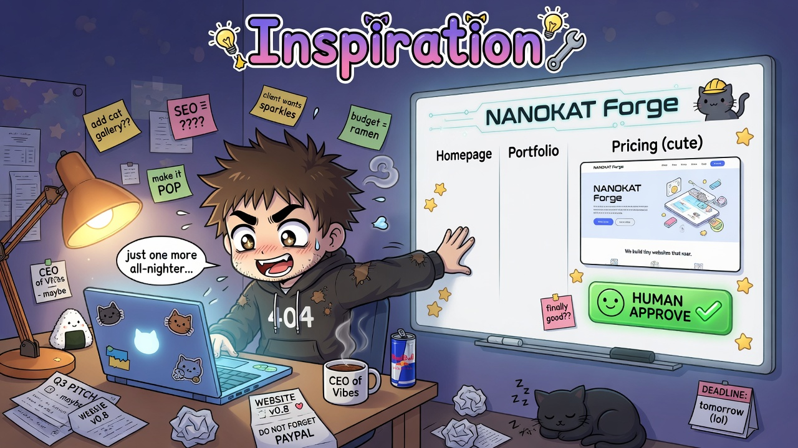
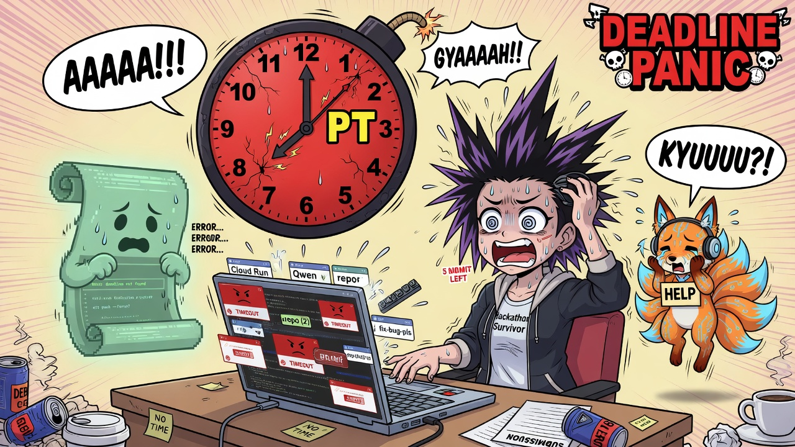
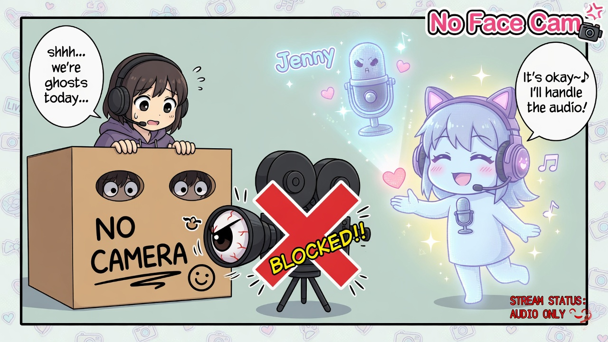
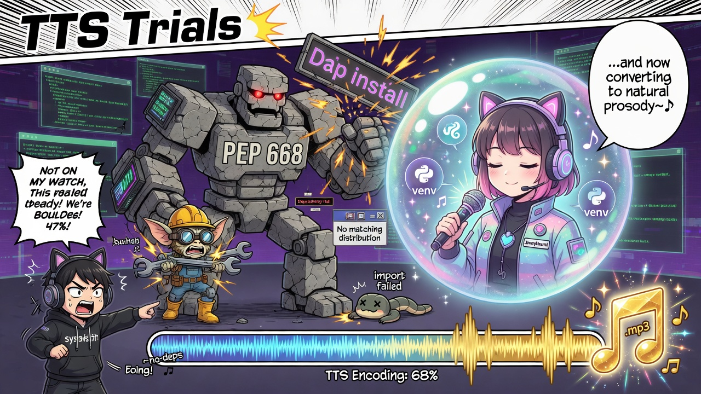
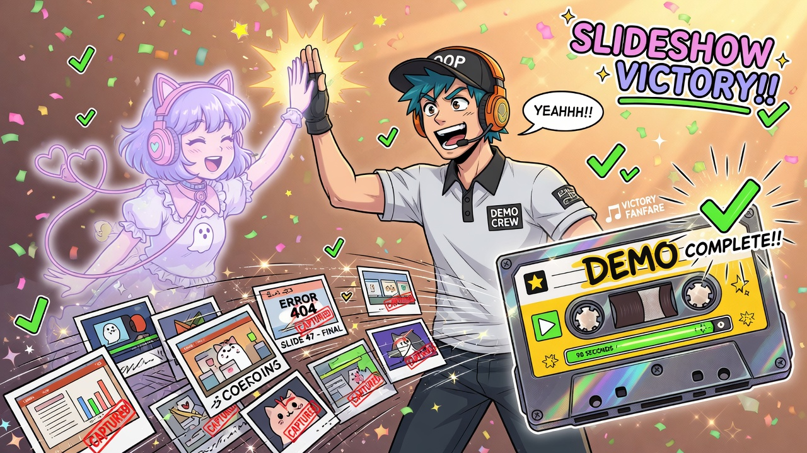
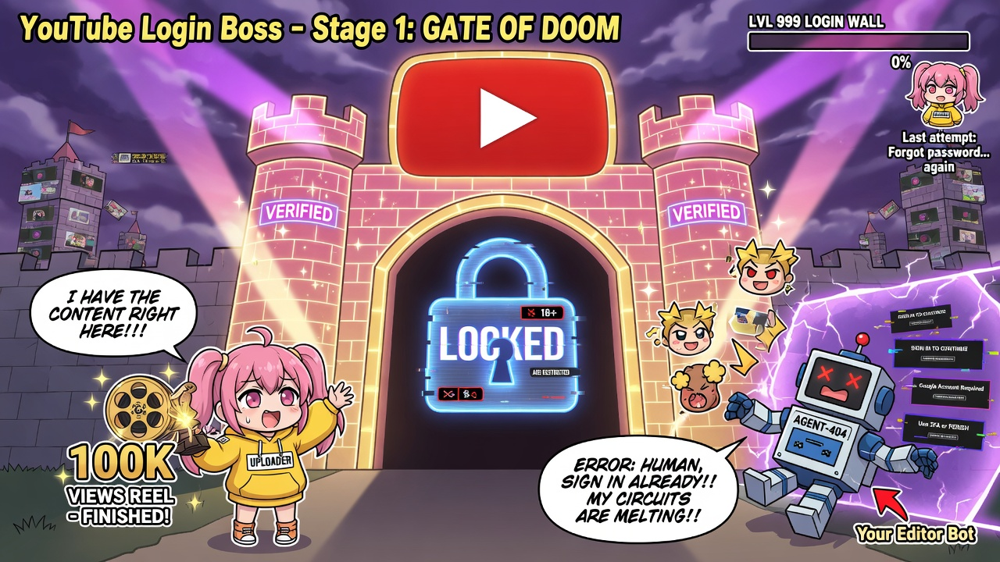
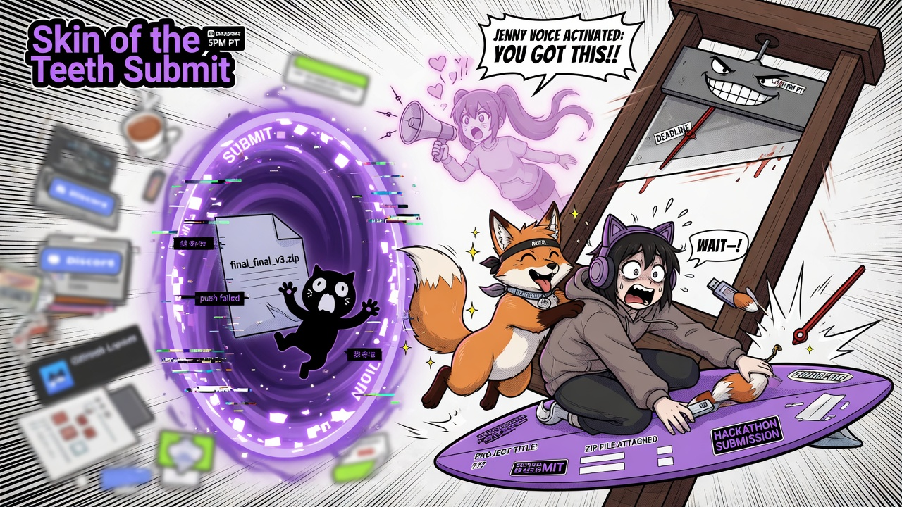
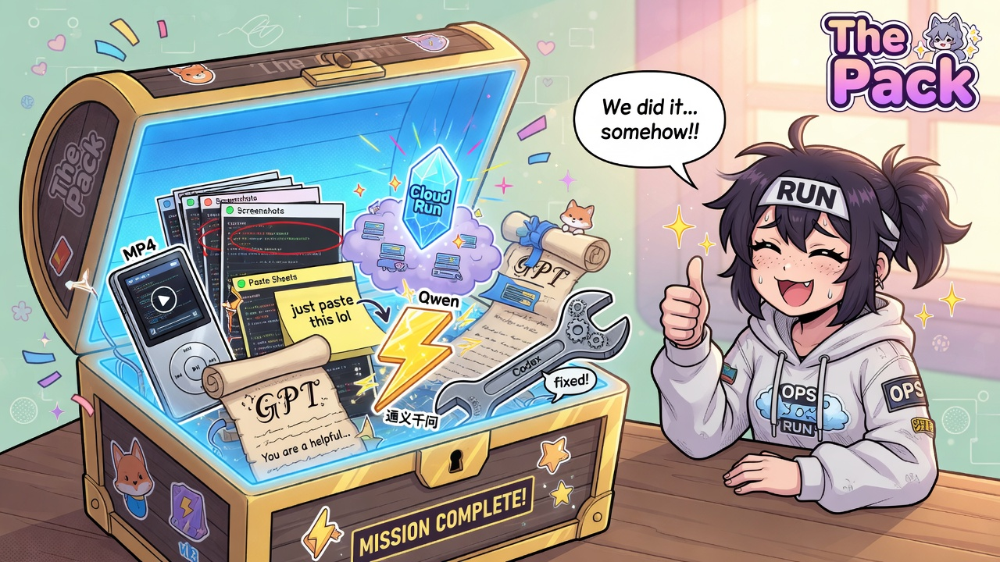

# Inspiration

Small-business website tools often leap from a vague prompt to “generated” output—no clear plan, no human on the consequential step, and a fuzzy story about which model actually ran. We wanted the opposite: take a messy idea, force it into a structured plan, require a human to approve, then show only an isolated preview with a trail that says nothing production was touched.

OpenAI Build Week was the excuse to build that kernel under real pressure—with GPT-5.6 and Codex shaping the work—while still shipping something judges could open. The inspiration wasn’t a face on camera or a multi-agent fairy tale. It was a forge that stays honest when the deadline guillotine drops.

---

# Anime comedy gallery — trials, tribulations, skin-of-the-teeth submission

Comical cel-shaded panels of the Build Week video saga. Still images are archived under `evidence/archive/images/anime-saga/`; reel: [`anime-saga-reel.mp4`](../02-media/video/anime-saga-reel.mp4).

## 01 — Inspiration

Messy briefs on one side; human-gated plan and isolated preview on the other.

## 02 — Deadline panic

Clock near 5 PM PT, tabs exploding, helpers sweating.

## 03 — No face cam

Operator behind a “NO CAMERA” box; soft VO spirit offers a mic instead.

## 04 — TTS trials

PEP 668 golem blocks install; virtualenv crystal protects the soft-voice avatar.

## 05 — Slideshow victory

Screenshots fly into a golden demo MP4; ninety-eight seconds of proof.

## 06 — YouTube login boss

Finished film reel at a locked sign-in gate; the last boss is authentication.

## 07 — Skin of the teeth submit

Deadline guillotine, SUBMIT form, zip and repo dragged through the portal.

## 08 — The pack

Treasure chest: video, screenshots, paste sheets, Cloud Run, honest model split.

---

## File index

| File | Beat |
|------|------|
| `01-inspiration.jpg` | Messy briefs → human-gated Forge |
| `02-deadline-panic.jpg` | 5 PM PT clock meltdown |
| `03-no-face-cam.jpg` | No camera; soft Jenny VO spirit |
| `04-tts-trials.jpg` | PEP 668 golem vs venv crystal |
| `05-slideshow-victory.jpg` | Screenshots → MP4 victory |
| `06-youtube-login-boss.jpg` | Sign-in wall boss fight |
| `07-skin-of-teeth-submit.jpg` | Guillotine deadline → SUBMIT |
| `08-the-pack.jpg` | Treasure chest of deliverables |
| `anime-saga-reel.mp4` | ~20s slideshow reel of all panels |

## Paths

- Markdown: `/home/nanokat/hack/nk-forge/evidence/01-submission-text/INSPIRATION_AND_GALLERY.md`
- Gallery folder: `/home/nanokat/hack/nk-forge/evidence/archive/images/anime-saga/`
